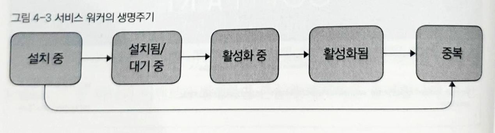

# PWA

- [PWA](#pwa)
- [1. 프로그레시브 웹 앱이란?](#1-프로그레시브-웹-앱이란)
  - [1.1 개요](#11-개요)
  - [1.2 PWA 장점](#12-pwa-장점)
  - [1.3 서비스 워커](#13-서비스-워커)
- [2. 서비스 워커 적용하기](#2-서비스-워커-적용하기)
  - [2.1 서비스 워커 만들기](#21-서비스-워커-만들기)
  - [2.2 점진적 향상](#22-점진적-향상)
  - [2.3 HTTPS와 서비스 워커](#23-https와-서비스-워커)
  - [2.4 웹에서 콘텐츠 가져오기](#24-웹에서-콘텐츠-가져오기)
    - [fetch(request[, options]);](#fetchrequest-options)
  - [2.5 오프라인 요청 감지하기](#25-오프라인-요청-감지하기)
    - [Content-Type을 붙이는 이유](#content-type을-붙이는-이유)
  - [2.6 서비스 워커의 범위(Scope) 이해하기](#26-서비스-워커의-범위scope-이해하기)
- [3. 캐시 스토리지 API](#3-캐시-스토리지-api)
  - [3.1 CacheStorage](#31-cachestorage)
  - [3.2 언제 캐시할지 결정하기](#32-언제-캐시할지-결정하기)
  - [3.3 CacheStorage에 요청 저장하기](#33-cachestorage에-요청-저장하기)
  - [3.4 CacheStorage로부터 요청 받아오기](#34-cachestorage로부터-요청-받아오기)
    - [CacheStorage는 동일 근원 정책을 따른다.](#cachestorage는-동일-근원-정책을-따른다)
    - [match(request[, options]);](#matchrequest-options)
  - [3.5 샘플 앱에서 캐싱하기](#35-샘플-앱에서-캐싱하기)
  - [3.6 각각의 요청에 올바른 응답 매칭하기](#36-각각의-요청에-올바른-응답-매칭하기)
    - [ignoreSearch](#ignoresearch)
  - [3.7 HTTP 캐싱과 HTTP 헤더](#37-http-캐싱과-http-헤더)
- [4. 서비스 워커 생명주기와 캐시 관리](#4-서비스-워커-생명주기와-캐시-관리)
  - [4.1 서비스 워커의 생명주기](#41-서비스-워커의-생명주기)
  - [4.2 서비스 워커의 수명과 waitUntil의 중요성](#42-서비스-워커의-수명과-waituntil의-중요성)
  - [4.3 서비스 워커 업데이트하기](#43-서비스-워커-업데이트하기)
  - [4.4 캐시를 관리해야 하는 이유](#44-캐시를-관리해야-하는-이유)
  - [4.5 캐시 관리 및 이전 캐시 제거](#45-캐시-관리-및-이전-캐시-제거)
    - [Promise.all()](#promiseall)
  - [4.6 캐싱된 response를 다시 사용하기](#46-캐싱된-response를-다시-사용하기)
  - [4.7 올바른 헤더 캐싱을 제공하기 위한 서버 설정](#47-올바른-헤더-캐싱을-제공하기-위한-서버-설정)
- [5. '오프라인 우선'을 받아들이기](#5-오프라인-우선을-받아들이기)
  - [5.1 오프라인 우선이란?](#51-오프라인-우선이란)
  - [5.2 일반적인 캐싱 패턴](#52-일반적인-캐싱-패턴)
    - [Cache only (캐시만 사용)](#cache-only-캐시만-사용)
    - [Cache. falling back to network (캐시, 실패하는 경우 네트워크)](#cache-falling-back-to-network-캐시-실패하는-경우-네트워크)
    - [Network only (네트워크만 사용)](#network-only-네트워크만-사용)
    - [Network, falling back to cache (네트워크, 실패하는 경우 캐시)](#network-falling-back-to-cache-네트워크-실패하는-경우-캐시)
    - [Cache, then network (캐시 이후 네트워크)](#cache-then-network-캐시-이후-네트워크)
    - [Generic fallback (기본 대체 리소스)](#generic-fallback-기본-대체-리소스)
  - [5.3 믹스 앤 매치, 새 패턴 생성하기](#53-믹스-앤-매치-새-패턴-생성하기)
    - [Cache on demand (요청에 따라 캐시)](#cache-on-demand-요청에-따라-캐시)
    - [Cache, falling back to network with frequent updates (캐시, 이후 네트워크 사용해 캐시 업데이트)](#cache-falling-back-to-network-with-frequent-updates-캐시-이후-네트워크-사용해-캐시-업데이트)
    - [Network, falling back to cache with frequent updates (네트워크, 실패하는 경우 캐시 사용 및 빈번한 캐시 업데이트)](#network-falling-back-to-cache-with-frequent-updates-네트워크-실패하는-경우-캐시-사용-및-빈번한-캐시-업데이트)
  - [5.4 어플리케이션 셸 아키텍처](#54-어플리케이션-셸-아키텍처)
    - [5.4.1 초기 렌더링에 콘텐츠 포함하기](#541-초기-렌더링에-콘텐츠-포함하기)
- [6. IndexedDB로 로컬에 데이터 저장하기](#6-indexeddb로-로컬에-데이터-저장하기)
  - [6.1 IndexedDB란?](#61-indexeddb란)
  - [6.2 IndexedDB 사용하기](#62-indexeddb-사용하기)
    - [6.2.1 DB 커넥션 열기](#621-db-커넥션-열기)
    - [6.2.2 DB 버전 번호 관리/객체저장소 변경](#622-db-버전-번호-관리객체저장소-변경)
    - [6.2.3 IndexedDB 버전 관리](#623-indexeddb-버전-관리)
    - [6.2.4 객체 저장소에 데이터 추가하기](#624-객체-저장소에-데이터-추가하기)
    - [6.2.5 Key로 객체 읽기](#625-key로-객체-읽기)
    - [6.2.6 커서로 객체 읽기](#626-커서로-객체-읽기)
    - [6.2.7 인덱스 생성하기](#627-인덱스-생성하기)
    - [6.2.8 인덱스로 데이터 읽기](#628-인덱스로-데이터-읽기)
    - [6.2.9 커서 범위 제한하기](#629-커서-범위-제한하기)

# 1. 프로그레시브 웹 앱이란?

## 1.1 개요

PWA(Progreesive Web App)은 네이티브 앱의 장점과 웹의 낮은 진입 장벽(low friction)이라는 두 가지 장점을 모두 지닌 새로운 종류의 웹 앱이다.

PWA는 간단한 웹사이트로 시작했지만, 휴대폰에 설치된 네이티브 앱과 똑같은 기능을 발휘하기까지 서서히 새로운 힘을 얻는다. 새로운 프로그레시브 모델은 **installed** 또는 **not installed**로 구분할 수 있는 이분법적인 앱의 성질을 대체할 수 있다.

**네이티브 앱의 문제점**은 사용자가 앱을 설치할 가능성은 해마다 점점 줄어드는데, 새로운 사용자를 확보하는 데 드는 비용은 늘고 있다. 그리고 사용자의 참여를 유지하는 것이 점점 더 어려워지고 있다. 또한 앱이 발전함에 따라 유지보수비가 늘어나 오래된 iOS와 안드로이드 버전에 대한 지원을 줄여야하는 상황이 닥치게 된다.

## 1.2 PWA 장점

PWA의 장점은 다음과 같다.

- 연결 상태와는 무관한 가용성(오프라인 지원)
- 빠른 로딩 시간
- 푸시(Push) 알림
- 홈화면 바로 가기

사용자가 PWA 홈페이지를 방문하면 **서비스 워커**가 등록 되어 사용자의 인터넷 연결 상태 변화를 감지하여 적절히 대응한다. 이를 통해 온라인, 오프라인, 불안정한 인터넷 상태와 관계없이 기능이 작동할 수 있다.

웹을 통해 접속하기 때문에 여러 앱과 다양한 기기를 지원하는 데 드는 기술 및 운영비용을 절감할 수 있다. 

## 1.3 서비스 워커

모든 PWA의 핵심은 **서비스 워커**이다. **서비스 워커**는 특정 사이트의 하나 혹은 그 이상의 페이지를 제어하는 스크립트이다. 일단 설치되면 단일 브라우저 창이나 탭의 외부에 위치한다.

그 곳에서, 서비스 워커는 자신이 제어하는 페이지에서 발생하는 이벤트를 수신한다. 웹에서 파일을 요청하는 이벤트를 가로채거나 수정하고 다시 페이지로 돌려보낼 수 있다.

    브라우저 탭 <-> 서비스 워커 <-> 웹

즉, 페이지(브라우저 탭)와 웹 사이에 네트워크 연결 상태와는 독립적으로 페이지 요청에 응답할 수 있는 계층(서비스 워커) 가 추가 되는데 이 계층(layer)은 사용자가 오프라인인 경우에도 작동한다. 오프라인 상태나 서버의 느린 응답을 감지(웹이 연결되지 않는 상태)하면 캐시된 콘텐츠를 대신으로 브라우저에 보낸다.

반면에 브라우저 탭이 닫힌 상태여도 서버(웹)와 통신하는 계층이 여전히 남아 있어 푸시알림을 수신 받을 수 있고 사용자가 수행했던 모든 작업이 전달될 수 있다.

# 2. 서비스 워커 적용하기

## 2.1 서비스 워커 만들기

다음과 같은 순서로 만든다.

1. 브라우저가 서비스 워커를 지원하는지 확인한 후 설치하는 코드
2. 브라우저에서 발생하는 이벤트에 따라 실행하는 서비스 워커 코드

1번은 프로젝트가 맨 처음으로 실행되는 최상단 위치에 아래의 코드를 입력을 한다. 

```javascript
if ("serviceWorker" in navigator) {
  navigator.serviceWorker.register("/serviceworker.js").then(function(registration) {
    console.log("Service Worker registered with scope:", registration.scope);
  }).catch(function(err) {
    console.log("Service Worker registration failed:", err);
  });
}
```

2번은 위의  `navigator.serviceWorker.register("/serviceworker.js")` 처럼 서비스워커 파일인 `serviceworker.js` 를 만든다. 

*serviceworker.js*

```javascript
self.addEventListener("fetch", function(event) {
  if(event.request.url.includes("bootstrap.min.css")){
		event.respondWith(
			new Response(
				".hotel-slogan {background: green!important;} nav {display: none}",
				{ headers: { "Content-Type": "text/css" }}
			)
		);
	}
});
```

위와 같이 이벤트리스너를 등록하여 원하는 작업을 한다. 예시는 모든 fetch 이벤트가 발생하면 작동되도록 해놓은 상태이다.

## 2.2 점진적 향상

현대적인 웹 앱의 핵심 철학은 바로 **점진적(Progressive) 향상**이다.

**점진적 향상**이란, 사용자가 경험할 수 있는 만큼의 기능을 제공하는 것을 의미한다. 이는 사용자가 특정 기능을 지원하지 않는 브라우저를 사용하는 경우에도, 작동이 멈추지 않는 사이트를 만들어야 함을 의미한다.

PWA는 점진적 향상을 염두에 두고 개발하는 것이 가장 이상적이지만, 기술적 요구 사항은 아니다.

## 2.3 HTTPS와 서비스 워커

서비스 워커는 요청을 가로채어 콘텐츠를 수정하거나 완전히 새로운 응답을 줄 수 있다. 이러한 점을 악용하면 제 3자가 중간자 공격(man-in-the-middle attack)을 시도할 수 있다. 이를 방지하고 사용자를 보호하기 위해 보안 연결(HTTPS)을 통해 제공되는 페이지만 서비스 워커를 등록할 수 있다.

개발 중에는 호스트이름이 *localhost*이라면 보안 연결 없이 서비스 워커를 사용할 수 있긴하다.

## 2.4 웹에서 콘텐츠 가져오기

서비스 워커가 웹에서 제공하는 콘텐츠로 요청에 응답하는 방법은 다음과 같다.

*serviceworker.js*

```javascript
self.addEventListener("fetch", function(event) {
  if(event.request.url.includes("/img/log.png")){
		event.respondWith(
			fetch("/img/logo-flipped.png")
		);
	}
});
```

"/img/log.png"에 대한 요청이 감지되면, fetch 명령을 사용해 새로운 대체 이미지 URL를 전달해 새로운 요청을 생성한다. fetch는 새로운 response를 포함하는 promise를 반환한다. 이 response를 인자로 Event.respondWith 메소드를 호출하여 원래 request 이벤트에 응답한다.

즉, 서비스 워커는 로고 요청을 기다리고 있다가, 요청을 받으면 원래 로고가 아닌 다른 로고를 적용한 결과를 브라우저 창으로 돌려보낸다.

### fetch(request[, options]);

fetch 함수의 첫 번째 인자는 필수이며 Request 객체나 절대 경로 혹은 상대 경로 형식의 URL 문자열을 받을 수 있다. 만약 Request 객체를 전달한다면 객체 안에는 URL외에도 헤더, 폼데이터 등이 포함되어 있을 수 있다.

두 번째 인자는 request에 대한 옵션 항목을 추가하는 객체지만 필수는 아니다. 

fetch는 promise를 반환하고, promise 객체는 response 객체로 resolve 될 수 있다.

## 2.5 오프라인 요청 감지하기

*serviceworker.js*

```javascript
self.addEventListener("fetch", function(event) {
	event.respondWith(
		fetch(event.request).catch(function(){
			return new Response(
				"접속불가"
			);
		})
	);
});
```

`fetch(event.request)` 까지만 작성했다면 서비스 워커를 적용하기 전과 다름없다. 하지만 `.catch` 를 통해 오프라인이 되었을 때 사용자에게 메시지를 전달할 수 있다.

여기서 더 나아가 HTML 페이지를 전송할 수 있도록 만들 수 있다.

*serviceworker.js*

```javascript
const responseContent = "<html>"+
"<body>"+
"<h1>접속불가</h1>"+
"<p>오프라인 상태입니다.</p>"+
"</body>"+
"</html>"

self.addEventListener("fetch", function(event) {
	event.respondWith(
		fetch(event.request).catch(function(){
			return new Response(
        responseContent,
        {headers:{"Content-Type": "text/html"}}
			);
		})
	);
});
```

fetch 이벤트가 발생하면, Fetch Event 객체가 인자로 넘어오고, 정의된 사용자 함수가 호출된다. 이때, FetchEvent의 respondWith 메소드를 호출하여, 기본 작동대신 원하는 형태로 fetch 이벤트에 응답할 수 있다.

`respondWith` 메소드는 하나의 인자를 받는다. 이 인자는 response 자체 혹은 응답 코드 값이며 나머지 코드는 response를 만들기 위한 코드이다.

`new Response` 를 통해 새로운 response 객체를 생성한다. 첫 번째 인자는 응답 본문을 담고 있고, 두 번째 인자는 응답에 추가 속성을 정의할 때 사용된다.  이 response 객체는 `event.respondWith` 호출을 통해 페이지로 반환하여, 정상적으로 웹 서버에서 반환된 응답처럼 작동하게 만든다.

### Content-Type을 붙이는 이유

대부분의 웹 서버는 널리 사용되는 파일을 전송할 때 자동으로 올바른 헤더 값을 지정한다. 즉, 서버가 HTML 파일을 전송할 때 HTML 본문과 여러 종류의 헤더 값이 포함된 response를 만든다. 그중 전송되는 파일의 종류를 알 수 있도록 Content-Type 헤더가 포함되어 있다. response를 처음부터 만들 경우 응답 본문뿐만 아니라 헤더값도 직접 올바르게 구성해줘야한다.

## 2.6 서비스 워커의 범위(Scope) 이해하기

서비스 워커 스크립트 파일(serviceworker.js)은 프로젝트 root 폴더에 저장하는 것이 좋다. 

서비스 워커를 통과하는 모든 요청을 마음대로 수정할 수 있기 때문에 어느 정도의 보안상의 제약이 필요하다. 그래서 각각의 서비스 워커는 컨트롤 범위가 제한되어 있는데 serviceworker.js이 위치한 디렉터리 위치에 의해 정해진다. 만약 serviceworker.js 파일을 root 디렉터리에 저장하는 경우, 서비스 워커가 사이트의 어느 곳에서 발생한 요청이든 제어할 수 있다. 반면 서비스 워커 스크립트 파일을 특정 디렉터리에 저장하면, 해당 서브 디렉터리를 대상으로 하는 요청만 서비스 워커로 전달된다.

```javascript
navigator.serviceWorker.register("/sw.js", {scope: "/Ginnos"});
```

`navigator.serviceWorker.register` 를 통해 서비스 워커를 등록할 때 추가로 scope option을 인자로 넘겨서 컨트롤 범위를 변경할 수 있다. 이를 통해 컨트롤 범위를 좀 더 좁힐 수 있지만, 넓힐 수는 없다.

# 3. 캐시 스토리지 API

## 3.1 CacheStorage

CacheStorage는 개발자가 완전히 제어할 수 있는 새로운 형태의 캐싱 레이어(Caching layer)이다.

과거 브라우저에 캐시가 있었지만 백그라운드에서 작동하는 캐시는 개발자가 제어할 수 없었다. 브라우저 캐시에 영향을 미칠 수 있는 유일한 방법은 서버가 각 응답과 함께 보내는 HTTP 헤더를 사용하여 콘텐츠에 대한 힌트를 브라우저에게 주는 것이였다.

CacheStorage는 이전 기술과 다르게 캐시 생성 및 관리를 위한 기본적인 API를 직접 제공한다. 덕분에 개발자는 원하는 수만큼 캐시를 생성하거나 열 수 있고, 응답 정보를 캐시에 저장, 검색, 삭제할 수 있다.

CacheStorage와 서비스 워커를 결합하여 캐시에서 뭘 삭제할지, 어떤 응답이 캐시로부터 반환되는지, 어떤 것이 네트워크로부터 반환되는지 프로그램으로 직접 제어할 수 있다.

## 3.2 언제 캐시할지 결정하기

사용자가 온라인 상태가 되었을 때 인덱스 파일과 다른 파일을 가져와야 한다. 이를 구현하기 위해 서비스 워커의 생명주기(lifecycle)을 알아야한다.

    설치중 --> 활성화 중 --> 활성화됨

서비스 워커의 install 이벤트는 서비스 워커가 가장 처음 등록된 직후, 그리고 이벤트가 활성화되기 전에 단 한 번만 발생하는 이벤트이다. 서비스 워커가 페이지를 제어하고 fetch 이벤트 수신을 시작하기 전에, 오프라인화 가능한 모든 파일을 캐싱할 기회를 얻을 수 있다.

Install 이벤트 내에서 서비스 워커 설치 자체를 취소할 수 있다. 이후 사용자가 사이트에 재방문하면 서비스 워커 설치가 다시 시작되므로 이를 활용하여 서비스 워커의 의존성을 효과적으로 관리할 수 있다. 또한 서비스 워커가 정상적으로 작동하는데 필요한 파일을 미리 내려받거나 캐시에 저장할 수 있으며, 이 과정에서 문제가 발생하면 설치 자체를 취소할 수도 있다.

## 3.3 CacheStorage에 요청 저장하기

*serviceworker.js*

```javascript
self.addEventListener("install", function(event){
  event.waitUntil(
    caches.open("gih-cache").then(function(cache){
      return cache.add("/index-offline.html");
    })
  );
});
```

위 코드에서 서비스 워커는 index-offline.html에 의존적이다. 따라서 성공적으로 서비스 워커가 설치되고 활성화되기 전에 성공적으로 캐싱되었는지 확인해야한다. 파일을 가져와 캐시에 저장하는 일이 비동기적으로 일어나기 때문에, 비동기 이벤트가 완료될 때까지, install 이벤트를 연기해야 한다.

`waitUntil` 은 전달된 프로미스가 resolve 될 때까지 이벤트의 수명을 연장한다. install 이벤트가 완료되기 전 파일을 캐시에 성공적으로 저장할 때까지 이벤트 수명을 연장할 수 있으며, 어느 단계에서든 문제가 생기면 프로미스를 reject함으로써 설치를 중단할 수 있다.

`waitUntil` 함수 내에서, caches.open을 호출하여 캐시명을 전달한다. `caches.open`은 기존 캐시를 열고 반환하거나, 해당 이름의 기존 캐시를 찾지 못하면 새로운 캐시를 생성하고 반환한다. `caches.open`은 프로미스로 래핑된 캐시 객체를 반환한다. 이후 then문을 사용해 캐시 객체를 변수로 받아들이는 함수로 전달한다.

마지막으로 `cache.add('/index-offline.html')`을 호출하여 파일을 가져오고 `"/index-offline.html"` 키와 함께 캐시에 저장한다.

install 이벤트가 발생한 후, 캐싱이 성공적으로 완료 될 때까지 그 어느 것이라도 멈추면 서비스 워커가 설치되지 않는다.

## 3.4 CacheStorage로부터 요청 받아오기

*serviceworker.js*

```javascript
...
self.addEventListener("fetch",function(event){
  event.respondWith(
    fetch(event.request).catch(function(){
      return caches.match("/index-offline.html");
    })
  );
});
```

이전 장과 다르게 새로은 응답을 만들거나 웹에서 가져오는 대신 `caches.match`를 호출해 CacheStorage에서 콘텐츠를 반환 받는다는 점이다.

### CacheStorage는 동일 근원 정책을 따른다.

`caches.match` 나 `caches.open`를 사용하여도 현재 origin에서 생성된 캐시에만 접근 가능하다.

### match(request[, options]);

match 메소드는 주어진 request에 대하여 캐시로부터 response 객체를 반환한다. 

```javascript
// 모든 캐시에서 일치하는 request를 검색
caches.match("logo.png");
// 특정 캐시에서 일치하는 request를 검색
caches.open("my-cache").then(function(){
  return caches.match("logo.png");
});
```

match의 첫 번째 변수는 캐시에서 검색을 위한 request 객체이거나 URL이다. 이것은 캐시에 추가한 request와 일치해야 한다. 두 번째 변수는 선택적 options 객체이다.

match는 캐시에서 가장 처음 검색된 response 혹은 일치하는 항목이 없는 경우 undefined로 프로미스를 반환한다.

match를 통하여 반환된 프로미스는 response를 찾지 못해도 reject되지 않기 때문에 response가 존재하는지 먼저 확인하고 반환해야한다.

```javascript
caches.match("logo.png").then(function (response) {
	if (response) {
		return response;
	}
});
```

## 3.5 샘플 앱에서 캐싱하기

*serviceworker.js*

```javascript
var CACHE_NAME = "gih-cache";
var CACHED_URLS = [
  "/index-offline.html",
  "https://maxcdn.bootstrapcdn.com/bootstrap/3.3.6/css/bootstrap.min.css",
  "/css/gih-offline.css",
  "/img/jumbo-background-sm.jpg",
  "/img/logo-header.png"
];

self.addEventListener("install", function(event) {
  event.waitUntil(
    caches.open(CACHE_NAME).then(function(cache) {
      return cache.addAll(CACHED_URLS);
    })
  );
});
```

`cache.add` 대신 `cache.addAll`을 호출하면 모든 URL을 배열로 가져와 캐시에 저장한다. 반환된 프로미스가 요청이 실패할 경우 reject된다.

## 3.6 각각의 요청에 올바른 응답 매칭하기

각각의 실패한 요청을 캐싱된 올바른 응답과 매치하여 제공하기위해 다음과 같이 fetch 이벤트 핸들러를 변경한다.

*serviceworker.js*

```javascript
...
self.addEventListener("fetch", function(event) {
  event.respondWith(
    fetch(event.request).catch(function() {
      return caches.match(event.request).then(function(response) {
        if (response) {
          return response;
        } else if (event.request.headers.get("accept").includes("text/html")) {
          return caches.match("/index-offline.html");
        }
      });
    })
  );
});
```

먼저 네트워크로부터 요청을 가져오고 사용자에게 해당 응답을 반환하려고 시도한다. 하지만 가져오는 것을 실패하면 catch 블록 내 함수가 실행된다.

캐시 안에 저장된 요청을 매칭하는 것에서 시작되며 `if(response)`를 통해 만약 캐시에서 응답이 발견되지 않는다면 index-offline.html을 반환한다. if문을 사용해 "text/html"인 요청에만 반환하도록 한다.

### ignoreSearch

request 객체를 전달하여 캐시에서 엔트리(entry)를 찾는 것은(ex. `caches.match(event.request)`) 잠재적인 위험을 가지고 있음을 기억해야 한다. 사용자는 항상 동일한 URL을 사용해 사이트를 방문하지 않는다.  

예를 들어 캐시에는 '/promo.html'가 저장되어있다면 사용자가 '/promo.html?utm_source=a'를 요청하여  `caches.match(event.request)`가 찾기 시작하지만, 실제로는 아무것도 찾지 못한다. 따라서 `match()`로 전달하기 전에 쿼리 문자열을 분리하는 특정 규칙을 작성하거나, URL 문자열이 'promo.html'을 포함하는지 테스트하고 `match()`에 하드 코딩된 URL을 전달하여 이 문제를 해결할 수 있다.

쿼리 변수가 페이지 콘턴츠에 아무 영향을 미치지 못한다는 확신이 있다면 `ignoreSearch`에 `match()`가 쿼리 변수를 무시하도록 지시할 수도 있다.

```javascript
caches.match(event.request, {ignoreSearch: true});
```

이렇게 되면, 쿼리 변수를 무시하고 request URL에 대한 엔트리와 매치된다.

## 3.7 HTTP 캐싱과 HTTP 헤더

CacheStorage는 이전의 HTTP 캐시를 대체하지 않는다. 

서버가 1년 동안 브라우저 캐시에 파일을 저장한다고 표기된 HTTP 헤더(ex. `Cache-Control:max-age=31536000`)와 함께 파일을 제공하는 경우, 브라우저는 캐시에서 그 파일을 계속 제공한다. 서비스 워커 내에서 파일을 가져온다면 네트워크로 가기 전에 브라우저 캐시를 여전히 체크할 것이다. [***참고***](https://jakearchibald.com/2016/caching-best-practices/)

# 4. 서비스 워커 생명주기와 캐시 관리

## 4.1 서비스 워커의 생명주기



**설치 중(Installing)**

`navbigator.serviceWorker.register`를 사용하여 새로운 서비스 워커를 등록할 때, 자바스크립트가 다운로드되고 파싱되고 나면, 서비스 워커는 **설치 중** 상태로 들어서게 된다. 설치가 성공적으로 이루어지면, 설치됨 상태로 변경된다. 설치 중 에러가 발생하면 새로고침하여 서비스 워커를 다시 등록하거나, 아니면 스크립트는 **중복(Redundant)** 상태의 구렁으로 영원히 빠져버린다.

`waitUntil()`를 호출하면, 설치 중 상태를 연장할 수 있다. 인자로 전달된 프로미스가 완료되기 전에는 서비스 워커의 상태가 변경되지 않는다.

**설치됨/대기 중(Installed/waiting)**

서비스 워커가 성공적으로 설치되면, **설치됨** 상태로 넘어가게 된다. 현재 활성화되어 있는 다른 서비스 워커가 앱을 제어하고 있지 않으면, 바로 **활성화 중** 상태로 전환된다. 앱을 제어하고 있는 경우에는 **대기 중** 상태가 유지된다.

**활성화 중(Activating)**

서비스 워커가 활성화 되어 앱을 제어하기 전, activate 이벤트가 발생한다. 설치 중 상태와 비슷하게, 활성화 중 상태 또한 `event.waitUntil()`을 호출하여 연장할 수 있다.

**활성화됨(Activated)**

서비스 워커가 활성화 되면, 페이지를 제어하고 fetch 이벤트와 같은 동작 이벤트를 받을 준비가 된다.

서비스 워커는 페이지 로딩이 시작하기 전에만 페이지 제어 권한을 가져올 수 있다. 즉, 서비스 워커가 **활성화**되기 전에 로딩이 시작된 페이지는 서비스 워커가 제어할 수 없다. 이는 서비스 워커가 예기치 않은 다양한 문제를 피할 수 있도록 하기 위함으로써 하나의 페이지는 로딩 시점부터 페이지를 닫을 때까지 하나의 서비스 워커만 제어하도록 되어있다.

**중복(Redundant)**

서비스 워커가 등록 중, 설치 중 실패하거나 새로운 버전으로 교체되면 **중복** 상태가 된다. 이 상태의 서비스 워커는 앱에 아무런 영향을 미치지 못한다.

서비스 워커와 서비스 워커의 상태는 개별 브라우저나 탭의 영향을 받지 않기 때문에 install 이벤트와 activate 이벤트는 서비스 워커의 생명주기동안 한 번만 발생한다.

## 4.2 서비스 워커의 수명과 waitUntil의 중요성

브라우저가 현재 등록된 서비스 워커를 항상 실행 상태로 유지하는 것은 아니다. 서비스 워커의 수명은 서비스 워커가 처리하는 이벤트와 직접적으로 연관되어 있다. 서비스 워커 범위 내에서 이벤트가 발생한다면, 서비스 워커는 활성화되고 이벤트를 처리한 후에 종료된다.

```javascript
self.addEventListener("push",function(){
  event.waitUntil(
    fetch("/updates")
      .then(function(){
        return self.registration.showNotification("New updates");
      })
  );
});
```

만약 서비스 워커의 이벤트 헨들링 코드가 비동기적으로 호출되도록 설정되어 있다면 `waitUntil`을 사용하여 필요한 작업이 완료될 때까지 이벤트 리스너 코드 실행을 연장시켜 서비스 워커가 종료되는 것을 방지할 수 있다. 따라서 서비스 워커의 수명도 함께 연장된다. 위의 예제에서 fetch와 `showNotification` 작업이 완료될 때까지 연장할 수 있다.

## 4.3 서비스 워커 업데이트하기

기존 서비스 워커를 변경하여 반영하기위해 새로고침을 하면 반영되지 않는 것을 볼 수 있다. 개발자 도구 Application에서 Service Workers를 보면 두 개의 서비스 워커가 등록되어 있지만 새로운 서비스 워커는 **대기 중** 상태에 머무는 동안 기존의 서비스 워커는 활성화되어 있다.

기존 서비스 워커의 범위에 해당하는 모든 탭과 윈도우 창이 종료되거나, 범위를 벗어난 새로운 페이지로 이동할 때까지, 새로운 서비스 워커는 대기 중 상태를 유지한다. 그래서 탭을 닫거나, 다른 사이트로 이동한 후 '뒤로 가기' 버튼을 누르면 이전 서비스 워커가 **중복** 상태로 변경되고, 새로운 서비스워커가 활성화된다.

이는 서비스 워커가 예기치 않은 다양한 문제를 피할 수 있도록 하기 위함으로써 열려 있는 모든 탭이 로딩된 순간부터 종료될 때까지 같은 서비스 워커로 제어되도록한다.

## 4.4 캐시를 관리해야 하는 이유

*serviceworker.js*

```javascript
var CACHE_NAME = "gih-cache-v2"; // 기존에 git-cache에서 변경
...
```

캐시명에 버전 넘버를 달고, 파일이 변경될 때마다 버전 숫자를 증가시키면, 다음 두 목표를 달성할 수 있다.

1. 변경 사항이 서비스 워커 파일에 반영되면, 브라우저는 활성화된 서비스 워커를 새로운 서비스 워커로 바꿔 설치해야 함을 알게 된다. 이는 새 파일을 내려받고 캐시에 저장하도록 하는 새 install 이벤트를 발생시킨다.
2. 이 방법은 각 버전의 서비스 워커에 해당하는 별도의 캐시를 생성한다. 캐시가 이미 업데이트되었더라도, 사용자가 열려 있는 모든 페이지를 닫기 전까지는 기존 서비스 워커가 활성화되어 있기 때문에 중요하다. 각각의 서비스 워커가 각자의 캐시를 가지고 있게 함으로써 예상치 못한 오류를 방지할 수 있다.

코드상으로는 "gih-cache-v2"가 캐시 버전명이지만, 캐시명을 종종 서비스 워커 버전명으로 참조한다. 그렇기 때문에 각 서비스 워커 버전에 대하여 각 캐시 버전을 유지하기로 했다면, 서비스 워커와 캐시 비전명을 동일하게 사용하면 작업이 훨씬 수월해진다.

## 4.5 캐시 관리 및 이전 캐시 제거

캐시와 서비스 워커의 버전을 관리함으로써, 서비스 워커의 버전마다 각각의 버전에 해당하는 캐시 파일에만 의존하면 되는 강력한 시스템을 구축할 수 있다. 서비스 워커는 캐시를 생성할 뿐만 아니라, 오래된 불필요한 캐시를 책임감 있게 처리해야한다.

```javascript
// 캐시명 배열을 resolve하는 프로미스를 반환
caches.keys().then(function(cacheNames) {
	cacheNames.forEach(function(cacheName) {
		// 해당 캐시를 삭제
		caches.delete(cacheName);
	});
});
```

앱은 최대 2개의 캐시가 필요로 한다. **1)** 현재 활성화되어 있는 서비스 워커에 대한 캐시가 하나 필요하고, **2)** 그리고 지금 막 설치되었으나 아직 활서오하되지 않은 새로운 서비스 워커에 대한 캐시가 하나 (존재하는 경우) 필요하다. 중복된 서비스 워커에 종속되어 있는 캐시는 모두 필요하지 않는다.

생명 주기 관점에서 보면 다음과 같다.

1. 새로운 서비스 워커를 설치할 때마다 새로운 캐시를 생성한다.
2. 새로운 서비스 워커가 활성화되면, 이전 서비스 워커가 생성해 두었던 모든 다른 캐시는 삭제하는 것이 안전하다.

첫 번째는 기존에 했던 방식(install 이벤트)을 사용하면 되고 두 번째는 activate 이벤트를 활용하면 된다.

```javascript
self.addEventListener("activate", function(event) {
  event.waitUntil(
    caches.keys().then(function(cacheNames) {
      return Promise.all(
        cacheNames.map(function(cacheNames) {
          if (CACHE_NAME !== cacheNames && cacheNames.startsWith("gih-cache")) {
            return caches.delete(cacheNames);
          }
        })
      );
    })
  );
});
```

서비스 워커는 활성화가 완료되기 전에 오래된 모든 캐시를 삭제할 때까지 기다릴 것(`waitUntil`)을 요청받는다.

### Promise.all()

`Promise.all()`은 프로미스 배열을 받고, 배열 내 모든 프로미스가 일단 resolve되면 resolve되는 한 개의 프로미스를 반환한다. 만약 그 프로미스 중 하나라도 reject된다면, `Promise.all()`이 생성한 프로미스 또한 reject될 것이다.

`Array.map()`을 통한 생성된 프로미스 배열을 `Promise.all()`로 전달한다. 모든 캐시가 성공적으로 삭제된 경우에만 resolve되는 프로미스가 생성된다. 이 프로미스를 `event.waitUntil()`로 전달한다.

이후 if문을 이용해 다음 두 조건을 충족하는 캐시만 삭제한다.

1. 방금 막 생성된 신규 캐시를 삭제하지 않도록 활성화되지 않은 캐시를 고른다.
2. 모든 서비스 워커의 캐시 이름으로 정한 임의의 접두어(ex. git-cache)를 확인한다.

## 4.6 캐싱된 response를 다시 사용하기

새로운 캐시를 생성할 때마다, cache.add()나 cache.addAll()을 사용하여 앱에 필요한 모든 파일을 캐싱한다. 하지만 사용자가 이미 기기에 cache-v1이라는 캐시를 가지고 있고, cache-v2를 새롭게 생성한다면 bootstrap.3.7.7.min.css와 같은 절대 변경될 일이 없는 파일들을 네트워크로부터 또 내려받게 될 것이다. 

절대 변경될 일이 없는 파일들을 캐싱하고 다시 내려받는 일이 있을 때 기존 캐시에서 새 캐시로 직접 복제하도록 하게끔하면 대역폭과 시간을 아낄 수 있다.

```javascript
var immutableRequest = [
  "/fancy_header_background.mp4",
  "/vender/bootstrap/3.3.7/bootstrap.min.css",
  "/css/style-v355.css"
];
var mutableRequests = [
  "app-settings.json",
  "index.html"
];
self.addEventListener("install", function(event){
  event.waitUntil(
    caches.open("cache-v2").then(function(cache) {
      var newImmutableRequests = [];
      return Promise.all(
        immutableRequests.map(function(url){
          return caches.match(url).then(function(response) {
            if (response) {
              return cache.put(url, response);
            } else {
              newImmutableRequests.push(url);
              return Promise.resolve();
            }
          });
        })
      ).then(function() {
        return cache.addAll(newImmutableRequests.concat(mutableRequests));
      });
    })
  );
});
```

위 코드는 캐싱해야 할 리소스를 2개의 배열로 분리한다.

1. `immutableRequests`에는 절대 바뀌지 않는 리소스를 가리키는 URL이 들어 있다. 이것은 캐시에서 캐시로 안전하게 복사가 가능하다.
2. `mutableRequests`에는 우리가 새로운 캐시를 생성할 때마다 네트워크로부터 받고자 하는 리소스를 가리키는 URL이 들어 있다.

Install 이벤트는 모든 `immutableRequests`를 검토하고 존재하는 모든 캐시에서 URL을 찾는다. 발견된 모든 URL은 cache.put을 사용하여 새로운 캐시로 복사된다. 발견되지 않은 URL은 `newImmutableRequests` 배열로 위치하게 된다.

모든 요청이 확인되고 나면, 코드는 `cache.addAll()`를 사용하여 `mutableRequests`와 `newImmutableRequests`에 존재하는 모든 URL을 캐시한다.

cf. `cache.addAll()`보다 간단한 `[cache.adderall()](https://www.talater.com/adderall/)`를 사용할 수 있다.

## 4.7 올바른 헤더 캐싱을 제공하기 위한 서버 설정

매번 로드될 때마다 서비스 워커 파일이 체크되기 때문에, 서버는 응답 헤더의 캐싱 만료 시간을 짧게 설정 해야 한다(ex 1~10분). 만료 시간을 너무 길게 설정하면, 브라우저는 변경 사항을 확인하지 않고, 캐시를 위한 신규 서비스 워커 버전이나 신규 파일을 검색하지 않는다. 브라우저는 개발자가 긴 만료 시간을 설정하려고 하더라도 24시간을 기본 만료 시간으로 설정한다.

# 5. '오프라인 우선'을 받아들이기

**모바일 우선(Mobile-First)** 시대에 접어들었지만, 연결 및 대역폭에 대한 접근 방식은 여전히 데스크톱 시대에 뿌리를 두고 있기에 **오프라인 우선(Offline-First)**으로 먼저 생각해야한다.

## 5.1 오프라인 우선이란?

기존의 웹 앱은 전적으로 서버에 의존했다. 모든 앱 데이터, 콘텐츠, 디자인 및 로직은 서버에 저장되어 있었다. 클라이언트는 화면에 HTML 페이지를 그리는 역할만을 담당했으나 웹 앱이 발전하면서 점점 더 많은 기능과 권한이 서버에서 클라이언트로 이동했고, 웹 앱은 데이터 처리, 템플릿 렌더링 등의 작업을 수행하게 되었다. 하지만 웹 앱은 네이티브 앱과 달리 여전히 전적으로 서버에 의존하고 있다. 따라서 인터넷 연결이 끊어지면 앱 구동에 실패할 수도 있다.

오프라인 우선은 오프라인 상태와 불안정한 인터넷 연결 상태에서도 대부분의 기능은(옾바르게 처리된다면) 계속 작동하게 끔 만드는 것이다. 그렇기에 연결 상태에 대한 변경 사항을 우아하게 처리해야한다.  그렇게 하면 사용자에게 앱을 계속 사용해도 된다는 신뢰와 데이터도 손실되지 않을 것이라는 확신을 줄 수 있다.

## 5.2 일반적인 캐싱 패턴

### Cache only (캐시만 사용)

모든 리소스 요청을 캐시를 통해 처리한다. 캐시에서 응답을 찾을 수 없을 경우 요청은 실패한다. 앱 작동에 필요한 모든 리소스가 이미 캐싱된 것으로 가정한다.

로고나 아이콘, 스타일시트와 같은 정적(static) 리소스를 처리하는 데 유용하다. 여기서 정적이란 하나의 앱 버전이 살아있는 동안 변하지 않음을 의미한다.

```javascript
self.addEventListener("fetch",function(event) {
  event.respondWith(
    caches.match(event.request)
  );
});
```

### Cache. falling back to network (캐시, 실패하는 경우 네트워크)

Cache only와 비슷하게 캐시에 저장된 콘텐츠를 먼저 찾고 찾지 못하면 네트워크로 콘텐츠를 요청한다.

```javascript
self.addEventListener("fetch",function(event) {
  event.respondWith(
    caches.match(event.request).then(function(response) {
      return response || fetch(event.request);
    })
  );
});
```

### Network only (네트워크만 사용)

웹의 전통적인 모델로 모든 리소스를 네트워크에서 가져온다. 네트워크 요청이 실패하면 전체 요청이 실패한다. 캐시를 활용할 필요가 없는 요청(ex. analytics pings) 등을 처리하는 데 유용하다.

서비스 워커에서 fetch 이벤트를 별도로 처리하지 않으면 Network Only 패턴이 적용 된다.

    self.addEventListener("fetch",function(event) {
      event.respondWith(
        fetch(event.request)
      );
    });

### Network, falling back to cache (네트워크, 실패하는 경우 캐시)

먼저 네트워크로 요청을 전달한다. 네트워크 요청이 실패하면, 캐시로부터 응답을 찾는다.

```javascript
self.addEventListener("fetch",function(event) {
  event.respondWith(
    fetch(event.request).catch(function() {
      return caches.match(event.request);
    })
  );
});
```

사용자는 항상 현재의 연결 상태에서 가장 최신의 콘텐츠를 내려받게 된다. 이 방법은 자주 변경되는 콘텐츠나 가장 최신 응답을 보여주는 것이 중요한 상황에서 유용하다.

### Cache, then network (캐시 이후 네트워크)

네트워크에서 최신 버전을 체크하는 동안 캐시에서 데이터를 바로 보여준다. 네트워크 응답을 받으면, 캐시보다 최신 버전인지 확인하고, 새 콘텐츠가 있는 경우 페이지를 업데이트한다.

이 방법은 네트워크를 통한 최신 콘텐츠 제공과 캐시의 빠른 응답이 결합된 가장 우수한 접근 방식으로 보이지만, 대신 구현 비용이 올라간다. 

두 가지 요청을 만들기 위해 앱을 수정하고, 캐싱된 콘텐츠를 표시하며, 마지막으로 새로운 콘텐츠가 사용 가능할 때 페이지를 업데이트한다. 여기서 중요한 것은 이 패턴이 앱에 새로운 UX 문제를 야기할 수도 있다는 점이다.

### Generic fallback (기본 대체 리소스)

사용자가 요청하는 콘텐츠가 캐시에 없고 네트워크도 사용할 수 없을 때, 이 패턴은 에러를 반환하는 대신 캐시에서 'default fallback (기본 폴백)'을 반환한다.

대표 사용 사례는 특정 이미지 대신 일반적인 이미지를 반환하는 것이다.

이 패턴은 보통 마지막 폴백(fallback)으로 다른 패턴들과 함께 사용된다. 예를 들어 network, falling back to cache 패턴과 같이 사용하면 다음과 같다.

```javascript
self.addEventListener("fetch",function(event) {
  event.respondWith(
    fetch(event.request).catch(function() {
      return caches.match(event.request).then(function(response) {
        return response || caches.match("/genric.png");
      });
    })
  );
});
```

## 5.3 믹스 앤 매치, 새 패턴 생성하기

일반적인 캐싱 패턴을 응용하여 콘텐츠를 캐싱하고 제공하는 새로운 방법을 알아보자.

### Cache on demand (요청에 따라 캐시)

자주 바뀌지는 않지만, 서비스 워커의 install 이벤트 동안 캐싱하고 싶지 않은 리소스에 대해서는 네트워크에서 반환된 요청을 캐시에 저장하기 위해 cache, falling back to network 패턴을 확장할 수 있다.

이 패턴을 활용하면 네트워크 응답을 받는 즉시 해당 리소스를 캐시에 저장할 수 있다.

```javascript
self.addEventListener("fetch",function(event) {
  event.respondWith(
    caches.open("cache-name").then(function(cache) {
      return cache.match(event.request).then(function(cachedResponse){
        return cachedResponse || fetch(event.request).then(
          function(networkResponse) {
            cache.put(event.request, networkResponse.clone());
            return networkResponse;
          }
        );
      });
    })
  );
});
```

최초에 리소스가 요청되면 캐시에서 찾을 수 없어 서비스 워커는 네트워크로부터 리소스를 받고, 캐시에 저장한 후 이를 반환한다. 다음에 이 리소스가 다시 요청되면, 캐시로부터 즉시 반횐될 것이다.

### Cache, falling back to network with frequent updates (캐시, 이후 네트워크 사용해 캐시 업데이트)

가끔씩 변경되긴 하지만, 최신 버전을 보여주는 것보다 빠른 응답이 더 중요한 리소스의 경우(ex. 사용자 아바타) cache, falling back to network 패턴을 수정하여, 요청한 리소스가 캐시에 있을 때에도 다음 요청을 위해 네트워크에서 최신 버전이 있으면 가져오도록 수정할 수 있다.

```javascript
self.addEventListener("fetch",function(event) {
  event.respondWith(
    caches.open("cache-name").then(function(cache) {
      return cache.match(event.request).then(function(cachedResponse){
        var fetchPromise = fetch(event.request).then(function(networkResponse) {
          cache.put(event.request, networkResponse.clone());
          return networkResponse;
        });
        return cachedResponse || fetchPromise;
      });
    })
  );
});
```

### Network, falling back to cache with frequent updates (네트워크, 실패하는 경우 캐시 사용 및 빈번한 캐시 업데이트)

항상 최신 리소스를 제공하는 것이 중요한 경우에는 network, falling back to cache 패턴 작동에 약간의 변화를 줄 수 있다.

```javascript
self.addEventListener("fetch",function(event) {
  event.respondWith(
    caches.open("cache-name").then(function(cache) {
      return cache.match(event.request).then(function(cachedResponse){
        cache.put(event.request, networkResponse.clone());
        return networkResponse;
      }).catch(function(){
        return cache.match(event.request);
      });
    })
  );
});+ 
```                                                                                

## 5.4 어플리케이션 셸 아키텍처

[앱 셸 아키텍처](https://developers.google.com/web/fundamentals/architecture/app-shell?hl=ko)는 앱에서 가장 기본적으로 인터페이스 표시하는 데 필요한 리소스와 기본 로직을 분리하도록 권장한다. 사용자에게 최대한 빨리 앱 셸을 표시할 수 있도록, 가능한 가볍게 만들 쉘을 우선 렌더링하여 보여주며, 이후 콘텐츠와 나머지 추가 기능은 로딩이 완료되어 사용 가능할 때 덧붙인다. 화면에 나중에 보여지게 될 부분보다 지금 '화면에 보여지는' 디자인 구조와 콘텐츠를 더 높은 우선 순위로 처리한다. 

앱 셸의 목표는 의미 있는 경험을 가능한 빨리 사용자에게 제공하는 것이다. 앱 셸 구조를 잘 활용한 프로그레시브 웹 앱은 밀리초 안에 기본 인터페이스를 로딩하여 화면에 보여줄 것이다.

앱 셸을 계획할 때 기본 UI를 렌더링할 수 있도록 최소한의 HTML, CSS, 자바스크립트, 이미지를 제공할 수 있도록 한다. 사용자가 처음으로 앱을 방문했을 때 최대한 빨리 로딩되고 실행될 수 있도록 쉘을 최대한 간소하게 유지한다. 로딩 후 바로 캐시에 저장되어야 하며, 연속 방문 시에는 네트워크 호출이 되기도 전에 캐시에서 로딩될 수 있도록 한다.

사용자가 홈페이지 첫 화면이나 관리 페이지 등 어디에서 시작하더라도 이상하지 않도록 앱 셸이 적절하게 구성되어야 한다.

### 5.4.1 초기 렌더링에 콘텐츠 포함하기

콘텐츠를 표시하기 위해 네트워크 응답을 기다려야 한다는 규칙은 없다. 경우에 따라 다르며 심지어 콘텐츠가 오래되었더라도 캐싱된 콘텐츠를 쉘과 함께 보여주는 방법이 더 합리적일 수 있다.

초기 렌더링에 콘텐츠를 포함하기 전에, 생각해볼 몇 가지가 있다.

1. 최신 버전이 아닐 가능성이 높은 콘텐츠를 캐시에서 렌더링한 다음, 몇 초 후 네트워크에서 최신 콘텐츠를 받아와 업데이트한다면, UX가 개선될까?
2. 캐싱된 콘텐츠를 받아 렌더링하는 방법이 앱의 초기 로딩 타임과 렌더링 속도에 영향을 미칠까?
3. 변경되는 데이터에 의존적이지 않고 항상 캐시로부터 처리될 수 있는 구성 요소는 무엇일까?
4. 기본 인터페이스가 렌더링된 후에 지연되거나 로딩될 수 있는 무거운 로직이 있을까?

기본 앱 셸을 계획할 때, 초기 렌더링을 의미 있게 만드는 절대적으로 중요한 구성요소가 무엇인지 생각해봐야 한다. 

# 6. IndexedDB로 로컬에 데이터 저장하기
브라우저에서 데이터를 지속적으로 처리하기위해서는 네트워크에 의존하지 않고도 데이터를 로컬에 저장하고, 읽고, 수정할 수 있도록 해야한다. 서버사이드 DB처럼, IndexedDB는 데이터를 구조적으로 저장할 수 있도록 해주고 쿼리 및 수정 등의 작업도 가능하게 한다. IndexedDB는 서버사이드 DB와 달리 모든 작업을 브라우저 내에서 처리할 수 있다.

## 6.1 IndexedDB란?

IndexedDB는 브라우저 내에서 제공된 트랜잭션 객체 저장소 DB이다. 이것의 특징은 다음과 같다.

1. 트랜잭션 기반으로 작동한다.
   - 수행하는 모든 작업은 트랜잭션으로 그룹화되고 성공 또는 실패로 작동 결과가 결정된다.
2. 객체 저장소 DB이다.
   - 테이블 기반이 아닌 객체를 저장하는 객체 저장소로 구성된다.
3. 인덱스된 DB이다.
   - 인덱스를 별도로 추가하면 기존 관계형 DB의 인덱스처럼 사용할 수 있다.
4. 브라우저 기반이다.
   - 저장된 모든 데이터는 사용자의 연결 상태에 관계없이 접근 및 조작이 가능하다.

로컬 DB(IndexedDB)의 변경 사항이 서버에 자동으로 반영되지 않기 때문에 개발자가 별도로 구현해야한다. 주의 사항은 다음과 같다.

1. 여러 개의 DB를 생성할 수 있다.
2. 각 DB는 여러 개의 객체 저장소를 들고 있다.
3. 각 객체 저장소에는 한 가지 타입의 데이터가 들어 있다.
4. 객체 저장소에는 Key-Value 쌍으로 된 레코드가 들어 있다.
5. 자바스크립트로 표현 가능한 대부분의 정보는 Value가 될 수 있다.
6. Key는 객체 저장소의 개별 값을 참조하는 데 사용된다.
7. **동일 출처 정책(same-origin plicy)**을 따른다.
8. DB는 버전을 갖기 때문에 DB 커넥션을 열어 `upgrade-needed` 이벤트를 통해 변경 사항을 반영해야한다.
9. 대부분의 작업은 비동기 방식이다.

IndexedDB를 사용하는 작업의 대부분은 다음의 기본 패턴으로 정리할 수 있다.

1. DB를 연다.
2. 객체 저장소에 읽기 혹은 쓰기를 하기 위해 트랜잭션을 시작한다.
3. 객체 저장소를 연다.
4. 객체 저장소에서 필요한 작업(객체 검색, 객체 추가 등)을 수행한다.
5. 트랜잭션을 완료한다.

## 6.2 IndexedDB 사용하기

### 6.2.1 DB 커넥션 열기

html 파일을 열어 `<script>` 내에서 작성하는 것이 실습하기 편하다.

```javascript
var request = window.indexedDB.open("my-database", 1);
request.onerror = function(event) {
  console.log("Database error: ", event.target.error);
};
request.onsuccess = function(event) {
  var db = event.target.result;
  console.log("Database: ", db);
  console.log("Object store names: ", db.objectStoreNames);
};
```

`window.indexedDB.open` 호출은 비동기 작업으로 DB 커넥션을 반환하지 않지만 DB 커넥션을 열기 위한 IDBRequest 객체를 반환한다. 이 객체를 통해, 해당 요청에 대한 이벤트(success 혹은 error 이벤트)를 수신할 수 있다. 브라우저에서 이 코드를 실행시키는 순간 브라우저 내에 `my-database`라는 이름의 DB가 생성되고(없다면) 열린다. 이후 success 이벤트가 발생하여 이벤트 콜백에서는 열린 IDBDatabase 객체 및 해당 DB에 포함된 객체 저장소 목록을 콘솔에 기록한다.

### 6.2.2 DB 버전 번호 관리/객체저장소 변경

서비스 워커와 마찬가지로 IndexedDB의 DB도 버전을 가지고 있다. 객체 저장소 추가, 변경, 삭제와 같이 DB 구조를 변경할 때마다 새로운 버전을 생성해야한다.

`indexedDB.open()`의 두 번째 인수로 전달되는 버전 번호를 증가시켜 DB 버전을 만들 수 있다. 브라우저가 기존 버전보다 큰 버전 번호를 감지하면 upgrade needed 이벤트가 발생한다. DB를 수정하려면 이 이벤트를 수신해 사용할 수 있다.

```javascript
// 버전을 1에서 2로 변경한다.
var request = window.indexedDB.open("my-database", 2);
request.onerror = function(event) {
  console.log("Database error: ", event.target.error);
};
request.onsuccess = function(event) {
  var db = event.target.result;
  console.log("Database: ", db);
  console.log("Object store names: ", db.objectStoreNames);
};

request.onupgradeneeded = function(event) {
  var db = event.target.result;
  db.createObjectStore("customers", {
    keyPath: "passport_number"
  });
};
```

upgrade needed 이벤트에서 DB 객체를 가져오고 `customers`라는 이름의 새 객체 저장소를 생성한다. 또한 `passport_number`를 저장소의 각 객체에 대한 고유 키로 정의하기 위해 `keyPath`를 사용한다.

### 6.2.3 IndexedDB 버전 관리

위의 코드에서 단순히 버전 번호만 바꾸면 객체 저장소의 영향으로 에러가 발생한다. 그렇기 때문에 현재의 상태에 따라 DB를 조건적으로 수정할 방법이 필요하다.

한 가지 방법으로 전통적인 DB 마이그레이션 기법을 활용하는 것이다. '마이그레이션'은 특정 버전의 DB를 그다음 상위 버전으로 올리기 위해 필요한 작업 모음이다. 단계를 거쳐 최신 버전으로 업데이트하게 된다.

```javascript
var request = window.indexedDB.open("my-database", 3);

request.onupgradeneeded = function(event) {
  var db = event.target.result;
  // 첫 방문은 oldVersion == 0
  var oldVersion = event.oldVersion;
  if (oldVersion < 2) {
    db.createObjectStore("customers", {
      keyPath: "passport_number"
    });
  }
  if (oldVersion < 3) {
    db.createObjectStore("employees", {
      keyPath: "employee_id"
    });
  }
};
```

위와 같이 DB의 이전 버전 번호를 확인하여, 모든 버전의 DB를 가장 최신 버전으로 가져오도록 만든다. 그러나 수십 개의 버전을 유지하기는 어려운 방법이다.

```javascript
var request = window.indexedDB.open("my-database", 3);

request.onupgradeneeded = function(event) {
  var db = event.target.result;
  if (!db.objectStoreNames.contains("customers")) {
    db.createObjectStore("customers", {
      keyPath: "passport_number"
    });
  }
};
```

단순히 높은 버전에서 생성되는 객체 저장소가 존재 여부로 수행하는 방법도 있다.

### 6.2.4 객체 저장소에 데이터 추가하기

```javascript
var request = window.indexedDB.open("my-database", 1);

request.onsuccess = function(event) {
  var db = event.target.result;
  var customerData = [
    {
      passport_number: "6651",
      first_name: "ChulSu",
      last_name: "Kim"
    },
    {
      passport_number: "6251",
      first_name: "Chu",
      last_name: "Sim"
    }
  ];

  // readwrite 트랜잭션을 생성하여 작업의 범위를 customers 객체 저장소로 지정
  var customerTransaction = db.transaction("customers", "readwrite");
  customerTransaction.onerror = function(event) {
    console.log("Error: ", event, target.error);
  };

  // 생성된 트랜잭션의 objectStore() API를 호출해 customers 객체 저장소를 열고, 
  var customerStore = customerTransaction.objectStore("customers");
  for (var i = 0; i < customerData.length; i++) {
    // 객체 저장소의 add() API를 호출해 객체를 추가
    customerStore.add(customerData[i]);
  }
};
```

트랜잭션 범위(scope)는 트랜잭션이 영향을 줄 수 있는 객체 저장소 이름 혹은 여러 개의 객체 저장소 이름을 포함한 배열이다. 범위를 정의하여, 서로 다른 트랜잭션 사이의 '경쟁 상태'를 방지할 수 있다. 두 개 혹은 그 이상의 readwrite 트랜잭션 범위가 겹치는 경우 각 트랜잭션은 큐에 들어가 순차적으로 실행될 것이다. 범위가 다르다면 병렬로 실행될 수도 있다.

### 6.2.5 Key로 객체 읽기

데이터(객체)를 읽는 것에는 세 가지 방법이 있다.

1. 키를 사용하여 단일 객체를 요청
2. 커서를 사용하여 저장소의 모든 객체를 순회
3. 인덱스를 사용하여 더 작은 데이터 그룹으로 검색(커서로 순회함)

먼저 키를 사용하는 방법은 다음과 같다.

```javascript
var request = window.indexedDB.open("my-database", 2);

request.onsuccess = function(event) {
  var db = event.target.result;
  var customerTransaction = db.transaction("customers");
  var customerStore = customerTransaction.objectStore("customers");

  // 찾고자 하는 고객 객체와 일치하는 Key(여권번호)를 전달, get()은 비동기 작업
  var request = customerStore.get("7727");
  // get 요청에 대한 onsuccess 이벤트를 수신하여 작업이 종료될 때까지 기다리고 요청한 객체를 반환
  request.onsuccess = function(event) {
    var customer = event.target.result;
    console.log("First name: ", customer.first_name);
    console.log("Last name: ", customer.last_name);
  };
};
```

### 6.2.6 커서로 객체 읽기

get()을 사용하여 객체 저장소에서 단일 객체를 검색하는 방법은 정확한 키를 알고 단일 객체를 검색할 때만 작동한다. 여러 객체를 검색하기 위해서는 커서를 사용해야 한다.

SQL과 달리 커서는 객체 저장소에 존재하는 하나의 레코드를 가리킬 뿐 결과를 포함하고 있지 않다. 즉, 단순히 객체 저장소에 존재하는 실제 객체에 대한 포인트 목록을 가리킨다. 이렇게 하면 모든 객체를 들고있을 메모리가 없어도 용량이 큰 객체 저장소를 순회할 수 있다.

```javascript
var request = window.indexedDB.open("my-database", 3);

request.onupgradeneeded = function(event) {      
  var db = event.target.result;
  var customerTransaction = db.tranaction("customers");
  var customerStore = customerTransaction.objectStore("customers");

  // 커서 오픈
  var customerCursor = customerStore.openCursor();

  // 커서가 앞으로 이동할 때마다 이벤트가 트리거 됨
  customerCursor.onsucess = function(event) {
    var cursor = event.target.result;
    if (!cursor) {
      return;
    }
    console.log(cursor.value.first_name);
    cursor.continue();
  };
};
```

커서가 다음 객체를 가리키도록 continue() 메소드를 호출한다. 커서가 앞으로 이동할 때마다 onsuccess 이벤트가 발생해 이벤트 리스너가 다시 실행되고 다음 고객의 이름을 로그로 남긴다.

심지어 마지막 데이터를 전달하거나 객체 저장소가 비어있더라도 커서가 앞으로 이동할 때마다 onsuccess 이벤트가 발생한다는 것을 기억해야 한다. 이때 커서(`event.target.result`)는 `null`을 가리킨다.

### 6.2.7 인덱스 생성하기

커서로 객체를 읽는 방법은 특정 조건에 맞는 객체를 검색하려고 할 때, 모든 객체 저장소를 살펴보아야 한다면 아주 비효율적이고 불편할 것이다.

여기에 인덱스를 사용하면 객체 저장소를 '쿼리(query)' 할 수 있고 쿼리와 매칭되는 레코드만 순회하여 살펴보는 커서를 열 수 있다.

```javascript
var request = window.indexedDB.open("my-database", 4);

request.onupgradeneeded = function(event) {
  var db = event.target.result;
  if (!db.objectStoreNames.contains("customers")) {
    db.createObjectStore("customers", {
      // inline key
      keyPath: "passport_number"
    });
  }
  if (!db.objectStoreNames.contains("exchange_rates")) {
    
    // exchange_rates 저장소 생성
    var exchangeStore = db.createObjectStore("exchange_rates", {
      // 고유 인덱스(out-of-line key) 자동 생성
      autoIncrement: true
    });

    // 인덱스가 사용해야하는 키 경로와 선택적 옵션 배열을 받음
    exchangeStore.createIndex("from_idx", "exchange_from", {
      // 키가 고유하지 않음을 명시
      unique: false
    });
    exchangeStore.createIndex("to_idx", "exchange_to", {
      unique: false
    });

    // db.createObjectStore() 호출에서 반환된 트랜잭션이 성공적으로 수행될 때 데이터 추가
    exchangeStore.transaction.oncomplete = function(event) {
      var exchangeRates = [
        {
          exchange_from: "CAD",
          exchange_to: "USD",
          rate: 0.77
        },
        {
          exchange_from: "JPY",
          exchange_to: "USD",
          rate: 0.009
        },
        {
          exchange_from: "USD",
          exchange_to: "CAD",
          rate: 1.29
        },
        {
          exchange_from: "CAD",
          exchange_to: "JPY",
          rate: 81.6
        }
      ];

      var exchangeStore = db
        .transaction("exchange_rates", "readwrite")
        .objectStore("exchange_rates");
      for (var i = 0; i < exchangeRates.length; i++) {
        exchangeStore.add(exchangeRates[i]);
      }
    };
  }
};
```

### 6.2.8 인덱스로 데이터 읽기

인덱스를 사용하면 특정 기준과 일치하는 결과만 순회하는 커서를 열 수 있다. CAD에서 다른 모든 통화에 대한 환율을 기록하는 코드는 다음과 같다.

```javascript
var request = window.indexedDB.open("my-database", 4);

request.onsuccess = function(event) {
  var db = event.target.result;
  var exchangeTransaction = db.transaction("exchange_rates");
  var exchangeStore = exchangeTransaction.objectStore("exchange_rates");
  // 인덱스를 가져옴
  var exchangeIndex = exchangeStore.index("from_idx");
  // 찾고자 하는 값을 전달하여 커서를 호출
  var exchangeCursor = exchangeIndex.openCursor("CAD");
  exchangeCursor.onsuccess = function(event) {
    var cursor = event.target.result;
    if (!cursor) {
      return;
    }
    var rate = cursor.value;
    console.log(rate.exchange_from + " to " + rate.exchange_to + ": "+ rate.rate);
    cursor.continue();
  };
};
```

### 6.2.9 커서 범위 제한하기

기본적으로 커서는 객체 저장소의 모든 객체 혹은 인덱스로부터 반환된 모든 객체를 순회한다. 필요한 경우 `IDBKeyRange` 객체를 전달하여 커서가 순회 할 범위를 제한할 수 있다.

```javascript
exchangeIndex.openCursor(IDBKeyRange.only("CAD"));
```

IDBKeyRange는 only()는 물론 lowerBound(), upperBound(), bound()도 지원한다. 이는 결과를 특정 범위로 제한할 수 있도록 한다.

only()와 같이, lowerBound() 그리고 upperBound()는 값을 첫 번째 인수로 받는다. 이 값은 범위의 하한 또는 상한값이 된다. 두 번째 인수는 결과가 범위 한계와 동일한 객체를 제외(true)할지 포함(false)할지 결정하기 위해 Boolean 값을 받는다.

bound()는 첫 번째 인수에 하한값, 두 번째 인수에 상한값, 그리고 각각의 포함 여부를 결정하는 Boolean값을 세 번째, 네 번째 인수에 입력한다.