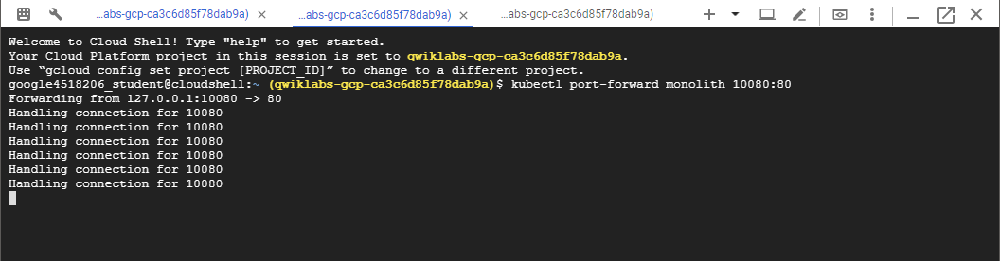

# Kubernetes in the Google Cloud

[Kubernetes in the Google Cloud | Qwiklabs](https://google.qwiklabs.com/quests/29)

# 1. Introduction to Docker

Docker는 오픈 플랫폼으로 컨테이너 기능으로 응용프로그램을 관리하고 배포하는 데 도움을 준다. Docker 컨테이너는 Kubernetes에서 직접 사용할 수 있으므로 Kubernetes 엔진에서 쉽게 사용할 수 있다.

이후의 모든 작업들은 Google Cloud Platform의 [Console](https://console.cloud.google.com)에서 실행한다. GCP 콘솔의 오른쪽 상단 툴바에서 Open Cloud Shell 버튼을 클릭한다.

**gcloud**는 Google Cloud Platform의 명령 도구이며 몇 가지 사용법은 아래와 같다.

    # 활성화된 계정 이름 출력
    gcloud auth list
    
    Credentialed accounts:
     - <myaccount>@<mydomain>.com (active)
    
    # 프로젝트 ID 나열
    gcloud config list project
    
    [core]
    project = <project_ID>
    
    # 프로젝트 ID 환경변수 지정, 명령어에서 ${GCP_PROJECT}로 사용
    export GCP_PROJECT=`gcloud config list core/project --format='value(core.project)'`

그외에 기본적으로 리눅스 명령어와 같기 때문에 `ls` 나 `vi` 등을 사용할 수 있다.

## 1.1 Hello-World

    # 'hello-world' 컨테이너 실행
    docker run hello-world
    
    Unable to find image 'hello-world:latest' locally
    latest: Pulling from library/hello-world
    9db2ca6ccae0: Pull complete
    Digest: sha256:4b8ff392a12ed9ea17784bd3c9a8b1fa3299cac44aca35a85c90c5e3c7afacdc
    Status: Downloaded newer image for hello-world:latest
    
    Hello from Docker!
    This message shows that your installation appears to be working correctly.
    ...

위 명령어를 곧바로 입력하면 docker 데몬은 hello-world 이미지를 로컬부터 검색한다. 만약 검색되지 않는다면 Docker Hub라는 공용 레지스트리에서 이미지를 가져 와서 해당 이미지에서 컨테이너를 생성하고 컨테이너를 실행한다.

Docker Hub에서 가져온 컨테이너 이미지를 보기위한 명령어는 다음과 같다.

    docker images
    
    REPOSITORY     TAG      IMAGE ID       CREATED       SIZE
    hello-world    latest   1815c82652c0   6 days ago    1.84 kB

IMAGE ID는 SHA256 해시 형식이다. 이 필드는 프로비저닝 된 Docker 이미지를 가리킨다. 

    # 실행중인 컨테이너를 살펴봄
    docker ps
    
    CONTAINER ID        IMAGE               COMMAND             CREATED             STATUS              PORTS               NAMES

실행중인 컨테이너를 살펴보면 현재 아무것도 없는데 이는 이전에 실행한 hello-world 컨테이너가 이미 종료되었기 때문이다.

실행 완료했던 내역까지 보고 싶다면 옵션으로 `-a` 를 붙인다.

    # 실행중, 실행되었던 모든 컨테이너를 살펴봄
    docker ps -a
    
    CONTAINER ID      IMAGE           COMMAND      ...     NAMES
    6027ecba1c39      hello-world     "/hello"     ...     elated_knuth
    358d709b8341      hello-world     "/hello"     ...     epic_lewin

## 1.2 Docker 이미지 작성

'test'라는 폴더를 만들고 들어간다.

    mkdir test && cd test

다음은 Docker 데몬에게 이미지를 어떻게 빌드할지 지시하는 파일인 `Dockerfile` 을 작성한다.

*Dockerfile*

    # Use an official Node runtime as the parent image
    FROM node:6
    
    # 컨테이너 작업 디렉토리 설정
    WORKDIR /app
    
    # 현재 디렉토리의 내용(".")을 컨테이너에 추가
    ADD . /app
    
    # 컨테이너 포트 공개 및 연결 허용
    EXPOSE 80
    
    # node 명령을 실행하여 응용프로그램(app.js) 시작
    CMD ["node", "app.js"]

다음으로 응용프로그램인 `app.js` 를 작성한다.

*app.js*

    const http = require('http');
    
    const hostname = '0.0.0.0';
    const port = 80;
    
    const server = http.createServer((req, res) => {
        res.statusCode = 200;
          res.setHeader('Content-Type', 'text/plain');
            res.end('Hello World\n');
    });
    
    server.listen(port, hostname, () => {
        console.log('Server running at http://%s:%s/', hostname, port);
    });
    
    process.on('SIGINT', function() {
        console.log('Caught interrupt signal and will exit');
        process.exit();
    });

포트 80에서 수신하고 "Hello World"를 반환하는 간단한 HTTP 서버이다.

마지막으로 이미지를 만든다. Dockerfile이 있는 디렉토리(`"."`)에서 명령을 실행해야하므로 주의하며 입력한다.

    docker build -t node-app:0.1 .
    
    Sending build context to Docker daemon 3.072 kB
    Step 1 : FROM node:6
    6: Pulling from library/node
    ...
    ...
    ...
    Step 5 : CMD node app.js
     ---> Running in b677acd1edd9
     ---> f166cd2a9f10
    Removing intermediate container b677acd1edd9
    Successfully built f166cd2a9f10

`-t` 는 `name:tag` 형식으로 이미지 이름과 태그를 정할 수 있다. 이와 같은 형식으로 작성하면 최신 이미지와 이전 이미지를 구별하기가 쉬워진다.

빌드 한 이미지를 살펴보면 다음과 같이 출력된다.

    docker images
    
    REPOSITORY     TAG      IMAGE ID        CREATED            SIZE
    node-app       0.1      f166cd2a9f10    25 seconds ago     656.2 MB
    node           6        5a767079e3df    15 hours ago       656.2 MB
    hello-world    latest   1815c82652c0    6 days ago         1.84 kB

node는 기본 이미지이며 사용자 node-app가 작성한 이미지이다. node-app을 제거하지 않고 node를 제거 할 수 없다 . 이미지의 크기는 VM에 비해 상대적으로 작다. `node:slim`과 `node:alpine` 같은 보다 더 가벼운 동일 이미지를 사용할 수 있다.

## 1.3 실행하기

작성한 이미지를 기반으로 컨테이너를 실행하기위해 아래의 명령어를 입력한다.

    docker run -p 4000:80 --name my-app node-app:0.1
    
    Server running at http://0.0.0.0:80/

옵션 `--name` 는 컨테이너 이름을 지정할 수 있고 옵션 `-p` 를 통해 컨테이너의 포트 80을 호스트의 포트 4000에 매핑시킨다.

다른 터미널을 열고 다음의 명령어로 서버를 테스트 해보자.

    curl http://localhost:4000
    
    Hello World

이번에는 백그라운드에서 컨테이너를 실행시켜보자.

    # 컨테이너를 중지하고 제거
    docker stop my-app && docker rm my-app
    
    # 옵션 -d를 통해 백그라운드에서 컨테이너 시작
    docker run -p 4000:80 --name my-app -d node-app:0.1
    
    # 실행중인 컨테이너 출력
    docker ps
    
    CONTAINER ID   IMAGE          COMMAND        CREATED         ...  NAMES
    xxxxxxxxxxxx   node-app:0.1   "node app.js"  16 seconds ago  ...  my-app

백그라운드에서 작동하므로 다음 명령어를 통해 출력된 log를 볼 수 있다.

    docker logs [container_id]
    
    Server running at http://0.0.0.0:80/

## 1.4 디버그

실행중인 컨테이너에서 대화식 Bash 세션을 시작하길 원하면 다음 명령어를 입력한다.

    docker exec -it [container_id] bash
    
    root@xxxxxxxxxxxx:/app#
    root@xxxxxxxxxxxx:/app#ls
    
    Dockerfile  app.js
    
    root@xxxxxxxxxxxx:/app#exit

Docker inspect를 사용하여 Docker에서 컨테이너의 메타 데이터를 검사 할 수 있다.

    docker inspect [container_id]
    
    [
        {
            "Id": "xxxxxxxxxxxx....",
            "Created": "2017-08-07T22:57:49.261726726Z",
            "Path": "node",
            "Args": [
                "app.js"
            ],
    ...

참고로 `--format` 이 반환 된 JSON의 특정 필드를 검사 할 때도 사용한다.

    docker inspect --format='{{range .NetworkSettings.Networks}}{{.IPAddress}}{{end}}' [container_id]
    
    192.168.9.3

## 1.5 Google Container Registry (gcr)에 등록

Google Container Registry에 이미지를 push하여 로컬에 저장된 컨테이너들을 모두 삭제해 최상의 환경을 유지할 수 있게 한다. 이미지는 필요할 때 필요한 것만 pull하여 사용할 수 있다.

gcr이 호스팅하는 비공개 레지스트리에 이미지를 푸시하려면 레지스트리 이름으로 이미지에 태그를 지정해야합니다. 형식은 [hostname]/[project-id]/[image]:[tag]입니다.

gcr의 경우 :

- `[hostname]`

    = gcr.io

- `[project-id]`

    = 귀하의 프로젝트 ID

- `[image]`

    = 귀하의 이미지 이름

- `[tag]`

    = 원하는 문자열 태그. 지정하지 않으면 기본값은 "latest"

다음을 실행하여 프로젝트 ID를 찾을 수 있다.

    gcloud config list project
    
    [core]
    project = [project-id]
    
    Your active configuration is: [default]

이후, 태그가 node-app:0.1인 이미지를 [project-id]가 포함된 이름으로 바꾼다.

    docker tag node-app:0.1 gcr.io/[project-id]/node-app:0.1
    docker images
    
    REPOSITORY                      TAG         IMAGE ID          CREATED
    gcr.io/[project-id]/node-app    0.1         76b3beef845e      22 hours ago
    node-app                        0.1         f166cd2a9f10      26 hours ago
    node                            6           5a767079e3df      7 days ago
    hello-world                     latest      1815c82652c0      7 weeks ago

이제 이미지를 gcr로 push를 한다.

    docker push gcr.io/[project-id]/node-app:0.1
    
    The push refers to a repository [gcr.io/[project-id]/node-app]
    057029400a4a: Pushed
    342f14cb7e2b: Pushed
    903087566d45: Pushed
    99dac0782a63: Pushed
    e6695624484e: Pushed
    da59b99bbd3b: Pushed
    5616a6292c16: Pushed
    f3ed6cb59ab0: Pushed
    654f45ecb7e3: Pushed
    2c40c66f7667: Pushed
    0.1: digest: sha256:25b8ebd7820515609517ec38dbca9086e1abef3750c0d2aff7f341407c743c46 size: 2419

push가 완료되면 GCP Console의 Tools > Container Registry에 들어가거나 [http://gcr.io/[project-id]/node-app](http://gcr.io/%5Bproject-id%5D/node-app)로 들어가면 이미지가 올라간 것을 확인할 수 있다.

컨테이너를 정지시키고 로컬에 저장된 이미지들을 정리를 한다.

    docker stop $(docker ps -q)
    docker rm $(docker ps -aq)
    docker rmi node-app:0.2 gcr.io/[project-id]/node-app node-app:0.1
    docker rmi node:6
    docker rmi $(docker images -aq) # remove remaining images
    docker images
    
    REPOSITORY          TAG                 IMAGE ID            CREATED             SIZE

이미지들이 제거가 완료되면 다음 명령어를 통해 gcr에서 받아 실행을 한다.

    docker pull gcr.io/[project-id]/node-app:0.1
    docker run -p 4000:80 -d gcr.io/[project-id]/node-app:0.1
    curl http://localhost:4000
    
    Hello World

만약 gcr에 저장한 이미지를 공개적으로 접속할 수 있도록 만들고 싶다면 권한을 변경한다.

    gsutil defacl ch -u AllUsers:R gs://artifacts.${GCP_PROJECT}.appspot.com
    gsutil acl ch -r -u AllUsers:R gs://artifacts.${GCP_PROJECT}.appspot.com
    gsutil acl ch -u AllUsers:R gs://artifacts.${GCP_PROJECT}.appspot.com

# 2. Kubernetes 엔진

Google Kubernetes Engine (GKE)은 Google 인프라를 사용하여 컨테이너화 된 응용 프로그램을 배포, 관리 및 확장 할 수있는 관리 환경을 제공한다. Kubernetes Engine 환경은 컨테이너 클러스터를 형성하기 위해 그룹화된 여러 컴퓨터 (특히 Google Compute Engine 인스턴스)로 구성된다.

Kubernetes 엔진 클러스터는 Kubernetes 오픈 소스 클러스터 관리 시스템을 기반으로 한다. Kubernetes는 컨테이너 클러스터와 상호 작용하는 메커니즘을 제공한다. Kubernetes 명령 및 리소스를 사용하여 응용 프로그램을 배포 및 관리하고, 관리 작업을 수행하고 정책을 설정하고, 배포 된 작업 부하의 상태를 모니터링한다.

Kubernetes는 인기있는 Google 서비스를 실행하는 것과 동일한 설계 원칙을 사용하고 애플리케이션 컨테이너 자동 관리, 모니터링 및 활성 검사, 자동 확장, 롤링 업데이트 등과 같은 동일한 이점을 제공한다.

Kubernetes Engine 클러스터를 실행하면 Google Cloud Platform에서 제공하는 고급 클러스터 관리 기능의 이점도 누릴 수 있습니다. 여기에는 다음이 포함됩니다.

- Compute Engine 인스턴스에 대한 [로드 밸런싱](https://cloud.google.com/compute/docs/load-balancing-and-autoscaling)
- [Node Pools](https://cloud.google.com/kubernetes-engine/docs/node-pools)은 추가 유연성을 위해 클러스터 내의 노드 서브 세트를 지정 가능
- 클러스터 노드 인스턴스 카운트 [자동 확장](https://cloud.google.com/kubernetes-engine/docs/cluster-autoscaler)
- 클러스터 노드 소프트웨어의 [자동 업그레이드](https://cloud.google.com/kubernetes-engine/docs/node-auto-upgrade)
- [노드 자동 복구](https://cloud.google.com/kubernetes-engine/docs/node-auto-repair)를 통한 노드 상태 및 가용성을 유지
- Stackdriver를 사용하여 클러스터 가시성을 위한 [로깅 및 모니터링](https://cloud.google.com/kubernetes-engine/docs/how-to/logging)

## 2.1 compute zone 설정

Google이 가지고 있는 전세계 서버 중 어느 지역에 클러스터와 리소스를 저장할지 compute zone을 설정한다.

    gcloud config set compute/zone us-central1-a
    
    Updated property [compute/zone].

## 2.2 Kubernetes Engine 클러스터생성

클러스터는 최소 하나의 클러스터 마스터 머신과 Nodes로 불리는 다중 워커 머신으로 구성되어 있다. Nodes는 클러스터의 일부를 만드는 데 필요한 Kubernetes 프로세스를 실행하는 컴퓨터 가상머신의 인스턴스이다.

    # my-cluster의 이름으로 클러스터 생성
    gcloud container clusters create my-cluster
    
    NAME        LOCATION       ...   NODE_VERSION  NUM_NODES  STATUS
    my-cluster  us-central1-a  ...   1.10.9-gke.5  3          RUNNING

중간에 경고메시지가 뜨는데 무시해도 괜찮다.

## 2.3 클러스터를 위한 인증 자격 증명 획득

클러스터를 생성한 후에 클러스터와 상호 작용할 수 있도록 인증 자격 증명을 얻어야한다.

    gcloud container clusters get-credentials my-cluster
    
    Fetching cluster endpoint and auth data.
    kubeconfig entry generated for my-cluster.

## 2.4 클러스터에 응용 프로그램 배포

클러스터가 만들어졌으니 클러스터에 컨테어너화된 응용 프로그램을 배포를 하자. 

Kubernetes Engine는 클러스터의 리소스를 만들고 관리하는데에 Kubernetes 객체를 사용한다. Kubernetes는 웹 서버와 같이 상태가 없는 어플리케이션을 배포하기 위해 Deployment 객체를 제공한다. 이 때 서비스 객체가 인터넷으로부터 어플리케이션에 접속하기 위한 [load balancer](https://nesoy.github.io/articles/2018-06/Load-Balancer)와 규칙들을 정의한다.

먼저 Kubernetes의 명령어인 `kubectl`를 통해 컨테이너 이미지 `hello-app` 으로 부터 Deployment `hello-server` 를 만든다.

    kubectl run hello-server --image=gcr.io/google-samples/hello-app:1.0 --port 8080
    
    deployment.apps "hello-server" created

`--image` 는 배포할 컨테이너 이미지를 지정한다. 현재 gcr의 예제 이미지를 가져왔다.

`--port` 는 컨테이너가 노출되는 포트를 지정한다.

다음으로 명령어 `kubectl expose` 를 통해 응용 프로그램을 외부 트래픽에 노출시키는 Kubernetes Service를 만든다.

    kubectl expose deployment hello-server --type="LoadBalancer"
    
    service "hello-server" exposed

`type="LoadBalancer"` 으로 컴퓨터 엔진이 컨테이너를 위한 load balancer를 만들게 한다.

서비스가 잘 만들어졌는지 확인해보자.

    kubectl get service hello-server
    
    NAME           TYPE           ...   EXTERNAL-IP      PORT(S)          AGE
    hello-server   LoadBalancer   ...   35.184.112.169   8080:30840/TCP   2m

`EXTERNAL-IP` 는 생성하는데 시간이 걸리니 Pending으로 출력된다면 잠시 후에 다시 실행해본다.

    http://[EXTERNAL-IP]:8080

`EXTERNAL-IP` 로 접속하면 어플리케이션이 동작되는 것을 볼 수 있다.

## 2.5 삭제

클러스터를 삭제를 하기 위해 다음 명령어를 입력한다. 제거하는 데 다소 시간이 걸린다.

    gcloud container clusters delete my-cluster

# 3. Kubernetes와 클라우드 조율

    # Kubernetes Engine 영역 설정
    gcloud config set compute/zone us-central1-b
    
    # 클러스터 시작
    gcloud container clusters create io
    
    # 샘플 코드
    git clone https://github.com/googlecodelabs/orchestrate-with-kubernetes.git
    
    ls
    deployments/  /* Deployment manifests */
      ...
    nginx/        /* nginx config files */
      ...
    pods/         /* Pod manifests */
      ...
    services/     /* Services manifests */
      ...
    tls/          /* TLS certificates */
      ...
    cleanup.sh    /* Cleanup script */

## 3.1 Quick Kubernetes 데모

Kubernetes를 시작하는 가장 쉬운 방법은 `kubectl create`명령을 사용하는 것이다. nginx 컨테이너의 단일 인스턴스를 시작한다.

    kubectl create deployment nginx --image=nginx:1.10.0

위 명령어를 통해 배포를 만들었고 배포를 통해 노드를 계속 실행하도록 할 수 있다.

Kubernetes에서는 모든 컨테이너가 Pods에서 실행된다. `kubectl get pods` 으로 실행중인 nginx 컨테이너를 볼 수 있다.

    kubectl get pods

nginx 컨테이너가 실행되면 다음으로 `kubectl expose`명령을 사용하여 Kubernetes의 외부에 노출시킨다.

    kubectl expose deployment nginx --port 80 --type LoadBalancer

Kubernetes는 공용 IP 주소가 첨부 된 외부 Load Balancer를 작성한다. 공용 IP 주소에 접속한 모든 클라이언트는 서비스 뒤에 있는 Pods로 라우팅된다. 이 경우에는 nginx Pods가 그렇게 작동한다.

`kubectl get services` 명령을 사용하여 현재의 서비스를 볼 수 있다.

    kubectl get services

`External IP` 가 생성되려면 잠깐의 시간이 필요할 수 있으니 만약 `pending` 으로 나온다면 다시 한 번 명령어를 입력하자.

External IP를 가지고 Nginx 컨테이너를 원격으로 접속해본다.

    curl http://<External IP>:80

## 3.2 Pods

Kubernetes의 핵심 중 하나는 포드(Pods)이다.

포드는 하나 이상의 컨테이너 콜렉션을 나타내고 보유한다. 일반적으로 서로에 대해 크게 의존하는 여러 컨테이너가 있는 경우 컨테이너를 하나의 Pod으로 묶는다.

포드에는 [볼륨(Volumes)](https://kubernetes.io/docs/concepts/storage/volumes/)이 있다. 볼륨은 포드와 함께 살아있는 데이터 디스크이며 해당 포드의 컨테이너에서 사용할 수 있습니다. 포드는 내용에 대한 공유 네임 스페이스를 제공한다. 즉, 예제 포드의 두 컨테이너가 서로 통신 할 수 있으며 연결된 볼륨도 공유한다는 것을 의미한다.

또한 포드는 네트워크 네임 스페이스를 공유한다. 이는 포드 당 하나의 IP 주소가 있음을 의미한다.

## 3.3 Pods 만들기

포드는 포드 구성 파일을 사용하여 만들 수 있다. 포드 구성파일인 `pods/monolith.yaml`를 살펴보자

    cat pods/monolith.yaml
    
    apiVersion: v1
    kind: Pod
    metadata:
      name: monolith
      labels:
        app: monolith
    spec:
      containers:
        - name: monolith
          image: kelseyhightower/monolith:1.0.0
          args:
            - "-http=0.0.0.0:80"
            - "-health=0.0.0.0:81"
            - "-secret=secret"
          ports:
            - name: http
              containerPort: 80
            - name: health
              containerPort: 81
          resources:
            limits:
              cpu: 0.2
              memory: "10Mi"

위 내용에 주목해야 할 몇 가지 사항이 있다.

- 현재의 포드는 하나의 컨테이너 (단일체)로 구성되어 있다.
- 시작할 때 컨테이너에 몇 가지 인수를 전달한다.
- http 트래픽에 대해 80번 포트를 여는 중이다.

이제 `pods/monolith.yaml`를 이용하여 포드를 만들어보자.

    kubectl create -f pods/monolith.yaml

`kubectl get pods`명령을 사용하여 기본 네임 스페이스에서 실행중인 모든 포드를 확인해보자.

    kubectl get pods

참고로 단일 컨테이너 이미지는 Docker Hub에서 가져오기 때문에 포드가 만들어지고 작동하는데에 시간이 걸릴 수 있다.

포드가 실행되면 `kubectl describe`명령을 사용하여 포드에 대한 자세한 정보를 볼 수 있다.

    kubectl describe pods monolith

포드 IP 주소 및 이벤트 로그를 포함한 포드에 대한 많은 정보를 볼 수 있다. 이 정보는 문제를 해결할 때 유용 할 것이다.

지금까지 한 과정을 요약하면 Kubernetes는 구성 파일에서 구성 요소를 설명하고 실행 중일 때 정보를 쉽게 볼 수 있도록함으로써 포드를 쉽게 만들 수 있다. 이 시점에서 배포에 필요한 모든 포드를 만들었다.

## 3.4 포드와 상호 작용

기본적으로 포드는 프라이빗 IP 주소가 할당되며 클러스터를 외부에서 접속 할 수 없다. 그러므로 `kubectl port-forward`명령을 사용하여 로컬 포트를 포드 안의 포트에 매핑한다.

이 시점부터 여러 Cloud Shell 탭에서 작업하여 포드 사이의 통신을 설정하도록 요청할 것입니다. 

두 개의 Cloud Shell 터미널을 연다. 하나는 `kubectl port-forward`명령을 실행하고 다른 하나는 `curl`명령을 실행 한다.

**두 번째 터미널**에, 포트 포워딩을 설정한다.

    kubectl port-forward monolith 10080:80

이제 **첫 번째 터미널**에서 포드의 응답을 받아보자.

    curl http://127.0.0.1:10080

컨테이너으로부터 `{"message":"Hello"}` 응답을 받았다.

이제 `curl`명령을 사용하여 보안 엔드 포인트에 도달했을 때 어떤 일이 발생하는지 확인해보자.

    curl http://127.0.0.1:10080/secure

인증 토큰이 없기 때문에 응답을 못받는다.

모노리스에서 인증 토큰을 다시 얻으려면 로그인하십시오.

    curl -u user http://127.0.0.1:10080/login

로그인 프롬프트에서 암호 "password"를 사용하여 로그인한다.

로그인하면 JWT 토큰이 출력된다. Cloud Shell은 긴 문자열 복사를 제대로 처리하지 못하기 때문에 토큰에 대한 환경 변수를 만들자.

    TOKEN=$(curl http://127.0.0.1:10080/login -u user|jq -r '.token')

비밀 번호를 묻는 메시지가 표시되면 다시 비밀 암호 "password"를 입력한다.

토큰을 복사 한 후 토큰을 사용하여 보안 엔드 포인트에 접속하기위해 `curl`명령을 사용한다. 

    curl -H "Authorization: Bearer $TOKEN" http://127.0.0.1:10080/secure

이번엔 정상적으로  `{"message":"Hello"}` 응답을 받았다.

**세 번째 터미널을 열고** `-f` 플래그를 사용하여 실시간 로그를 가져온다.

    kubectl logs -f monolith

이제 **첫 번째 터미널**에서 `curl`로 요청하는 것을 **세 번째 터미널**의 로그로 볼 수 있다.

    curl http://127.0.0.1:10080

포드에서 대화 형 셸을 실행 하기위해 `kubectl exec`명령을 사용한다. 이는 컨테이너 내에서 문제를 해결할 때 유용할 수 있다.

    kubectl exec monolith --stdin --tty -c monolith /bin/sh

예를 들어 모노리스 컨테이너에 셸이 있으면 다음 `ping`명령을 사용하여 외부 연결을 테스트 할 수 있다 .

    ping -c 3 google.com

대화 형 쉘 작업을 끝나면 로그 아웃한다.

    exit

포드와 상호 작용하는 것은 `kubectl`명령을 사용하는 것만큼 쉽습니다 . 원격으로 컨테이너에 접근해야하거나 로그인 쉘을 사용해야하는 경우, Kubernetes는 필요한 모든 것을 제공한다.

## 3.5 서비스

포드는 활력이 없거나 준비 상태 검사와 같은 여러 이유로 중지되거나 시작될 수 있으며 문제가 발생한다.

일련의 포드와 통신하고 싶다면 어떻게 할까? 다시 시작할 때 IP 주소가 다를 수 있다.

이를 위해 [서비스](http://kubernetes.io/docs/user-guide/services/)는 포드에 안정적인 엔드 포인트를 제공한다.

서비스는 라벨을 사용하여 어느 포드를 작동시킬지 결정한다. 만약 올바른 라벨이 있으면 자동으로 선택되고 서비스에 노출된다.

서비스가 포드 집합에 제공하는 액세스 수준은 서비스 유형에 따라 다르다. 현재 세 가지 유형이 있다.

- `ClusterIP`

    (내부) - 기본 유형은 이 서비스가 클러스터 내부에서만 볼 수 있음을 의미한다.

- `NodePort`

    클러스터의 각 노드에 외부에서 액세스 할 수 있는 IP를 제공한다.

- `LoadBalancer`

    클라우드 제공 업체의 로드 밸런서를 추가한다. 로드 밸런서는 서비스의 트래픽을 노드에서 노드로 전달한다.

## 3.6 서비스 만들기

서비스를 만들기 전에 https 트래픽을 처리 할 수 있는 안전한 포드를 만들어 보자.

디렉토리를 변경했다면 다음 디렉토리로 돌아간다.

    cd ~/orchestrate-with-kubernetes/kubernetes

단일 서비스 구성 파일을 탐색합니다.

    cat pods/secure-monolith.yaml

보안 단일 포드 및 해당 구성 데이터를 작성한다.

    kubectl create secret generic tls-certs --from-file tls/
    kubectl create configmap nginx-proxy-conf --from-file nginx/proxy.conf
    kubectl create -f pods/secure-monolith.yaml

이제 안전한 포드가 생겼으니 보안 단일 포드를 외부에 노출 할 차례이다. 이를 위해 Kubernetes 서비스를 만든다.

먼저 단일 서비스 구성 파일을 살펴보자.

    cat services/monolith.yaml
    
    kind: Service
    apiVersion: v1
    metadata:
      name: "monolith"
    spec:
      selector:
        app: "monolith"
        secure: "enabled"
      ports:
        - protocol: "TCP"
          port: 443
          targetPort: 443
          nodePort: 31000
      type: NodePort

주의 사항 :

1. selector는 "pid = monolith" 및 "secure = enabled" 레이블을 가진 모든 포드를 자동으로 찾고 노출시킨다.
2. 포트 31000에서 nginx (포트 443)로 외부 트래픽을 전달하는 방법을 사용할 것이므로 여기에서 노드 포트가 공개되어야 한다.

단일 서비스 구성 파일로부터 단일 서비스를 생성하려면 `kubectl create` 명령을 사용한다.

    kubectl create -f services/monolith.yaml
    
    service "monolith" created

포트를 사용하여 서비스를 노출하고 있다. 즉, 다른 응용 프로그램이 서버 중 하나의 포트 31000에 바인드하려고하면 포트 충돌이 발생할 수 있다.

일반적으로 Kubernetes는 이 포트 지정을 처리합니다. 이 실습에서는 이후에 있을 포트 상태 검사를 구성하는 것이 더 쉽도록 하기위해 포트를 선택했습니다.

노출 된 노드 포트의 단일 서비스에 대한 트래픽을 허용하려면 `gcloud compute firewall-rules` 명령을 사용한다.

    gcloud compute firewall-rules create allow-monolith-nodeport \
      --allow=tcp:31000

모든 것이 설정되었으므로 이제는 포트 포워딩을 사용하지 않고 클러스터 외부에서 보안 단일 서비스에 접근할 수 있어야한다.

먼저 노드 중 하나에 대한 외부 IP 주소를 가져옵니다.

    gcloud compute instances list

이제 `curl`다음을 사용하여 보안 단일 서비스에 요청을 보내본다.

    curl -k https://<EXTERNAL_IP>:31000

제대로 응답을 못 받는 결과를 볼 수 있다. 왜냐하면 포드에 레이블이 없기 때문이다.

## 3.7 포드에 레이블 추가하기

현재 단일 서비스에는 엔드포인트가 없다. 이와 같은 문제를 해결하는 한 가지 방법은 레이블 쿼리와 함께  `kubectl get pods`명령을 사용하는 것이다.

이를 통해 단일 레이블로 작동하는 포드가 꽤 많이 있다는 것을 알 수 있다.

    kubectl get pods -l "app=monolith"

그러나 "app = monolith"및 "secure = enabled"는 어떨까?

    kubectl get pods -l "app=monolith,secure=enabled"

이 레이블 쿼리는 아무것도 출력되지 않는다. 이제 포드에 "secure = enabled"레이블을 추가하자.

`kubectl label`명령을 사용하여 누락 된 `secure=enabled`레이블을 보안 단일 포드 에 추가하자 . 그런 다음 레이블이 업데이트되었는지 확인한다.

    kubectl label pods secure-monolith 'secure=enabled'
    kubectl get pods secure-monolith --show-labels

이제 포드에 올바르게 레이블이 지정되었으므로 단일 서비스의 엔드 포인트 목록을 살펴본다.

    kubectl describe services monolith | grep Endpoints

다시 요청을 해보면 정상적으로 응답을 받을 수 있다.

    gcloud compute instances list
    curl -k https://<EXTERNAL_IP>:31000

## 3.8 **Kubernetes로 응용 프로그램** 배포

프로덕션 환경에서 컨테이너를 스케일링하고 관리 할 준비가 되는 것이 목표이다. 그곳이 [배포](http://kubernetes.io/docs/user-guide/deployments/#what-is-a-deployment)가 들어오는 곳이 된다. 배포는 실행중인 포드의 수가 사용자가 지정한 포드의 수와 동일한지 확인하는 선언적 방법이다.

배포의 주요 이점은 포드 관리에 대한 낮은 수준의 세부 사항을 추상화하는 것입니다. 화면 뒤에서 배포는 [복제 세트](http://kubernetes.io/docs/user-guide/replicasets/)를 사용하여 포드 시작 및 중지를 관리한다. 포드를 업데이트하거나 확장해야하는 경우, 배포가 이를 처리한다. 어떤 이유로든 다운될 경우 배포가 다시 시작되도록 처리한다.

예를 들면 포드는 노드가 생성된 노드의 수명에 묶여 있다. 위의 예에서 Node3은 아래로 내려갔다 (포드와 함께). 새 포드를 수동으로 생성하고 Node를 찾는 대신 배포는 Node2에서 새로운 Pod를 생성하고 시작했다.

포드 및 서비스에 대해 배운 모든 것을 결합하여 배포를 사용하여 단일 응용 프로그램을 더 작은 서비스로 분해해야한다.

## 3.9 **배포 만들기**

단일 앱을 세 가지로 나눈다.

- **auth**

    - 인증 된 사용자에 대해 JWT 토큰을 생성한다.

- **hello**

    - 인증 된 사용자에게 인사한다.

- **frontend**

    - 트래픽을 auth 및 hello 서비스로 라우팅한다.

각 서비스마다 하나씩 배포를 만들 준비가 되었다. 그런 다음 인증 및 hello 배포를 위한 내부 서비스와 frontend 배포를 위한 외부 서비스를 정의한다. 작업이 끝나면 단일 앱과 마찬가지로 마이크로 서비스와 상호 작용할 수 있게 되며 이제는 각 앱을 개별적으로 확장 및 배포 할 수 있게 되었다.

인증 배포 구성 파일을 검토하여 시작하자.

    cat deployments/auth.yaml
    
    apiVersion: extensions/v1beta1
    kind: Deployment
    metadata:
      name: auth
    spec:
      replicas: 1
      template:
        metadata:
          labels:
            app: auth
            track: stable
        spec:
          containers:
            - name: auth
              image: "kelseyhightower/auth:1.0.0"
              ports:
                - name: http
                  containerPort: 80
                - name: health
                  containerPort: 81
    ...

배포시 1 개의 복제본이 생성되며 버전 1.0.0의 인증 컨테이너를 사용하고 있다.

인증 배포를 생성하기 위해 `kubectl create` 명령을 실행하면 배포 매니페스트의 데이터를 준수하는 하나의 포드가 만들어진다. 즉, 복제본 필드에 지정된 번호를 변경하여 포드의 수를 조정할 수 있다.

다음과 같이 배포 객체를 만든다.

    kubectl create -f deployments/auth.yaml

 `kubectl create`명령을 이용하여 인증 배포를 위한 서비스를 만들어야합니다. 

    kubectl create -f services/auth.yaml

이제 hello 배포를 만들고 노출하려면 동일한 작업을 수행한다.

    kubectl create -f deployments/hello.yaml
    kubectl create -f services/hello.yaml

프론트 엔드 배포를 만들고 노출하는 데 한 번 더.

    kubectl create configmap nginx-frontend-conf --from-file=nginx/frontend.conf
    kubectl create -f deployments/frontend.yaml
    kubectl create -f services/frontend.yaml

컨테이너와 함께 일부 구성 데이터를 저장해야하기 때문에 frontend를 만드는 단계가 한 단계 더 있다.

frontend와 통신하기 위해 외부 IP를 잡아서 curl를 한다.

    kubectl get services frontend
    curl -k https://<EXTERNAL-IP>