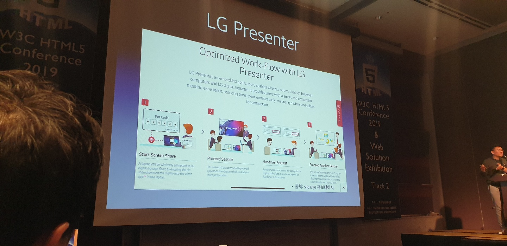

# 1. Project Fugu

최홍찬/구글

홈: hoch.io, 깃헙: hoch, 트위터: @hochsays

데스크탑 어플을 웹 기반으로 어떻게 대체를 할까?

1) Soundation (음악제작 어플)

2010년을 시작으로 Flash를 활용하여 만들었다. 그러나 Flash의 낮은 퍼포먼스, 애플의 지원 종료 발표로 인해 2015년에 크롬 팀과 함께 PNaCl이라는 샌드박스를 이용하여 C++로 제작하여 웹에서 구동할 수 있게끔 만들었다. 하지만 이는 곧 웹 표준을 어기는 것이였다. 2018년에는 크롬 팀과 함께 HTML5에 포팅하는 것을 시도하였다. 웹이지만 멀티스레딩을 적용하여 이전 성능 대비 300% 높아졌다.

8년동안 한 프로젝트에 대해 3번을 갈아치운 원인은 웹 표준화의 느린 속도로 꼽는다.

2) Spotify (음악 스트리밍 서비스)

웹 페이지를 앱처럼 사용할 수 있는 PWA를 적용하였다.그러나 처음에 앱 설치를 요구하는 것은 처음 사용자에게는 거부감을 느끼게 만들었다. 그에 대안으로 진입에 대한 작은 보상으로 노래 한 곡을 무료로 재생하였고 PWA의 가장 성공한 사례로 꼽힐 정도로 좋은 결과를 얻었다.

Spotify는 Desktop App을 만들 때 Chromium Embedded Framework(CEF)를 활용하였다.

필요한 기능이 부재로 개발자들이 쉽게 PWA를 이용하여 Desktop App을 만들기가 어렵다.

3) Web Audio API

2010년부터 시작하여 올해로 9년째이지만 활용률이 적다. 이는 API가 개발자가 필요하는 기능을 제공하지 않았기 때문이다. 여기서 API 확장성이 중요해진다. 확장성을 통하여 Empower된 개발자들이 하나의 Ecosystem을 만들고 사용자들이 많아지게 된다. 또한 이를 활용하는 플랫폼도 개선이되며 개발자들은 의욕을 갖고 개발할 수 있는 선순환 구조를 만들 수 있다.

Web Audio API의 문제점은 개발자의 소통이 없어서 그렇다.

그래서 웹 표준화의 속도 개선하고, 필요한 기능을 탑재하며 개발자의 소통이 있어야한다.

**Project Fugu**
## 1. 웹 플랫폼과 네이티브와의 기능 차이를 줄인다. 
현재 90개가 넘는 기능이 개발 중이다.

1) 개발자의 의견을 듣고 이를 바탕으로 
2) 캐쥬얼한 문서를 만든다. 
3) 이에 대한 피드백을 받고 2)-3)이 반복된다. 
4) 피드백을 바탕으로 스펙을 만들고 오리진 트라이얼을 거쳐 
5) 출시한다.

[익스플레이너](https://w3ctag.github.com/)

사용자들이 격고 있는 문제점의 분명한 정의 문제에 대한 접근방법과 해결책의 제안 해결책, 제안된 디자인에 기반한 코드예제를 제시한다.

[오리진 트라이얼](https://github.com/GoogleChrome/OriginTrials)

새로운 웹 기능을 안전하게 실험하는 것을 목적으로 새 기능을 사용한 앱으로 직접 유저 테스트가 가능하다. 의미있는 피드백을 얻을 수 있는 채널이다.

발급받은 키를 문서에 넣으면 Github에서 인식한다.

## 2. 웹의 장점은 그대로 보존하면서
크롬 팀은 권한/허가, 개인정보 보호, 보안을 중요하게 여겼고 세 가지 사항을 지킨 API를 만들면 Desktop을 뛰어 넘을 수 있을 것이라 기대한다.

## 3. 개발자들이 웹에서 새로운 경험을 만들어낼 수 있도록 한다.

[Fugu API Tracker](https://goo.gle/fugu-api-tracker/)는 2019년 10월 현재 87개의 기능/API를 개발 중에 있고 컨퍼런스에서 공개한 API는 아래와 같다. 

1) [Web Share & Web Share Target](https://wicg.github.io/web-share-target/) - Shipped
2) [Media Session API](https://wicg.github.io/mediasession) - Shipped
3) [Shape Detection API](https://wicg.github.io/shape-detection-api/) - In development
4) [Badging API](https://wicg.github.io/badging/) - In development
5) [Native File System](https://wicg.github.io/native-file-system/) - In development
6) [Web Serial API](https://wicg.github.io/serial/) - In development
7) [Web HID API](https://wicg.github.io/webhid/) - In development

새로운 기능 제안은 [링크](https://bit.ly/new-fugu-request)를 통해 제안할 수 있다.

# 2. Move the Web Forward
김효/웨일브라우저

웨일브라우저는 2~30대 업무시간 집중, 윈도우 베이스의 높은 생산성이 필요한 사용자가 많이 쓴다.

## 1) 광고차단

광고에 대한 진영은 Coalition for Better Ads와 AcceptableAds, ABP로 두 진영으로 나눠진다.

CBA 표준이라고 광고에 대한 표준이 있다.

광고로 운영하는 네이버 서비스지만 웨일 사용자의 요구는 광고차단이 많았다. 그래서 좋은 광고 이외의 광고들을 막는 것으로 선택하였고 다음과 같은 과정으로 적용된다.

CBA와 구글 광고 표준에 우배되는 사이트 필터링 -> 위배되는 사이트에 포함된 광고 차단 적용

1차 필터는 naver, google, CBA가 가지고 있는 사이트를 조합하여 걸러낸다.

2차 필터는 Subresource Filter로 성능이 떨어지지 않게끔 만들기위해 여러 Rule과 Request를 수집하여 규칙을 만들었다. 자바스크립트 방식의 광고를 막는데 Overhead가 많이 발생된다. 광고차단 확장 앱이 자바스크립트를 제거하기 때문에 가끔 자바스크립트로 동작하는 버튼도 기능을 없애버리기도 한다.

## 2) 웹인증서

플러그인 설치 없는 웹환경을 만들기 위해 웹인증서 API를 만들고 있다.
신한 은행과 협력하여 브라우저에 내장된 보안 키보드를 띄울 수 있게 만들었다.
웹인증서 API 1.0을 활용하는데 랜더박스와 자바스크립트가 복잡하게 사용된다. 반면 2.0에서는 간소화되어 좀 더 편리하게 되었다.

## 3) 오픈소스의 무게 Rebase

오픈소스를 많이 사용되기 위해서는 Rebase를 하는 것이 좋지만 힘들다. 그러나 제품 품질을 올리는 가장 효과적인 방법이기도 하다.

Phase 1: 초도 버전 리베이스 (by rebase 장인) - 혼자 만든다, 4주
Phase 2: 각 모듈 담당자 리베이스 - 리팩토링, 3주
Phase 3: QA/안정화

- 리베이스 기간중 기능 개발, 모바일 리베이스 등의 업무도 병행
- 테스트, 성능, 메모리 등 관련 설비 개발은 미산정

작업 기간이 시간이 지날 수록 줄어들고 실력이 숙련되어 버그도 줄어들고 있다.

Rebase하면서 개발 환경도 바뀌기 때문에 주의해야한다.

# 3. React/VUE에서 이젠 SVELTE
변규현/당근마켓

SVELTE(스벨트)
- 코드를 적게 쓴다. - 쉽고 간편한 코드를 작성한다. (readable)
- No Virtual DOM
- 배우기 쉽다.
  
스벨트는 `
`, `<Template>`처럼 최상위에 태그를 감쌀 필요가 없다.
리엑트는 리엑트에 종속된 문법(Hook, JSX, 함수 API 등)을 배워야 하지만 스벨트는 일반적인 JS를 작성하듯이 사용하면 된다.

성능을 위해 JS로 직접 DOM을 조작할 때가 있다. 이렇게 하는 것보다 리엑트로 작업하는 것이 더 무겁기 때문에 오히려 성능이 필요할 때 버벅이는 경우가 있다. 그래도 가상 DOM은 충분히 빠르고 성능이 보장되기 때문에 사용한다. 가상 DOM이 느린 경우는 많은 DOM을 출력할 때다. 

가상 DOM이 완성되는 시간보다 Diffing하는 시간이 많이 걸린다. React가 개발 될 당시 JQuery에 비해 가상 DOM을 채용하는 것이 가장 빨랐기에 그걸 선택하였고 그것밖에 없었다.

스벨트와 리엑트의 가장 큰 차이점은 Build time에서 차이가 난다. Build time에서 많은 에러를 잡을 수가 있다.

또한 메모리가 동일 페이지에 React는 110MB 정도면 SVELTE는 30MB 정도 차지하며 React는 내부적으로 동작되기 때문에 들쑥날쑥한 반면에 SVELTE는 그 변동이 적다.

Typescript 지원이 아직 완전하진 않다. 스벨트를 위한 라이브러리는 아래와 같다.

# 4. React Native 성능 개선
김나람 / 스튜디오 그로테스큐

전역적 상태 관리 - Redux, MobX, Context API

## 1) Redux

**장점**

Redux는 가장 오래된 라이브러리로 높은 점유율을 차지하고 있으며 react-redux 패키지를 사용한다. 

Reducer가 dispatch를 통한 action을 받아서 상태를 갱신한다. Provider를 통해 store와 연결할 수 있도록 한다.

**단점**

코드의 양이 너무 많고 이로 인해 리팩토링 이슈가 생겼을 때 소극적이 된다는 점이 단점이다.

## 2) MobX

**장점**

MobX는 극강의 편의성으로 최신 기술을 적극적으로 도입힌다. mobx-react 패키지를 사용한다. `@observable`과 `@observer`를 사용하여 빠르게 개발할 수 있다.

**단점**

너무 급진적인 신기술을 도입했기 때문에 바벨 프리셋 설정이 필수며 안드로이드 엔진에서 최신 버전 MobX를 지원하지 않는다. 큰 규모의 애플리케이션이면 옵저버블 분할 계획이 필수다. 다중 스토어를 권장한다.

발표자의 경험으로는 forceUpdate로 인해 속도가 느려졌다.

## 3) Context API

**장점**

Context API는 React 16부터 도입되어 Zero Configuration으로 사용할 수 있다.

발표자의 경험으로는 MobX 대비 렌더 횟수가 60% 감소되었다.

**단점**

그러나 미들웨어가 필요하다면 직접 구현해야한다.

그로테스큐에서 자주 사용하는 패턴은 [링크](https://github.com/grotesq/context-q)를 통해 확인할 수 있다.

# 5. Azure Pipelines를 이용한 Electron CI/CD 구축기

이웅재 / Studio XID

발표자료 [링크](http://slides.com/woongjae/w3c-html5-conf-2019/)

## 1) 일렉트론을 상용앱으로 패키징하기

일렉트론은 원래 만들어진 코드를 넣어 데스크탑 어플리케이션으로 만들어준다. 주로 HTML, CSS, JS를 사용한다.

쉽게 데스크탑 어플리케이션으로 만들 수 있다고 나와있지만 실제로 그렇지 않다.

asar는 보안 이유가 아닌 편리성때문에 사용한다.

electron-builder를 통해 dmg, exe 등 설치파일로 만들 수 있다.

윈도우의 Smart Screen 때문에 EV 인증서를 사용해야하는데 이 인증서가 비싸다. 저렴한 것은 Smart Screen이 뜬다.

## 2) 릴리즈와 자동 업데이트 이해하기

autoUpdater를 활용한다. 그리고 업데이트 서버를 만든다. 윈도우에서는 inno setup을 사용한다.

## 3) gitlab runner 를 이용한 빌드 머신 운영

gitlab은 CI/CD관련 서비스를 제공해줘서 좋다.

gitlab runner는 Go로 작성되었으며 백그라운드 프로세스로 작동된다.

그러나 고사양 머신이라도 느리고 이유없이 실패하는 경우가 있어서 Azure Pipelines를 이용하게 되었다. 또한 EV 인증서를 위해 USB를 사용하고 있어야한다.

## 4) Azure Pipelines

public은 싸고 private는 비싸지만 기능 차이가 많다. yml 적용이 안된다.
편하지만 비싸다.

# 6. Vue.js 입문자가 실무에서 주의해야 할 5가지 실수
장기효 / KossLab

발표자료 [링크](https://github.com/joshua1988/vue-five-common-mistakes)

## 1) 반응성 - 왜 내 화면은 다시 그려지지 않을까?

- 반응성은 인스턴스가 생성될 때 `data`의 속성들을 초기화할 때 설정된다. 
- 생성하는 시점에 없었던 `data`는 반응하지 않는다. (ex. user.state = true를 하려고 하지만 .state는 선언되어있지 않으면 변하지않는다.)

**반응성을 이해하지 못할 때 실수**

- 화면에서만 필요한 UI 상태 값을 다룰 때
- 백엔드에서 불러온 데이터에 임의의 값을 추가하여 사용하는 경우

참고로 Vuex의 state도 data와 동일하게 취급한다.

## 2) DOM 조작

기존에는 `document.querySelector()`를 이용하였지만 Vue에서 제공하는 ref를 사용하면 된다. 또한 Vue directive를 사용한다. 이에 따라 기존에 DOM 제어 사고 전환이 필요하다.

## 3) 라이프 사이클

뷰의 템플릿 속성은 인스턴스, 컴포넌트의 표현부를 정의하는 속성이다. 여기서 작성하는 템플릿은 실제 DOM 엘리먼트가 아닌 JS 객체인 Virtual DOM이다. 그래서 템플릿 속성이 실제로 유효한 시점은 인스턴스가 화면에 부착된 후인 `mounted`일 때이다. 그러므로 `created`에서 `document.querySelector`를 이용하여 DOM 조작을 시도하려고 해도 작동되지 않는다.

## 4) ref 속성

특정 DOM 엘리먼트나 하위 컴포넌트를 가리키기 위해 사용되는 속성으로 DOM 엘리먼트에 사용하는 경우 DOM 정보를 접근할 수 있다. 

또한 하위 컴포넌트에 지정하는 경우 컴포넌트의 인스턴스 정보에 접근할 수 있다. 만약 `v-for` 디렉티브에 사용하는 경우 Array 형태로 해당 정보를 제공한다.

**ref 속성을 사용할 때 주의할 점**
- ref 속성은 템플릿 코드를 render 함수로 변환하고 나서 생성
- 접근할 수 있는 최초의 시점은 `mounted` 라이프사이클
- `v-if` 디렉티브와 사용하는 경우 화면에 해당 영역이 그려지기 전까진 DOM 요소 접근 불가
- ref 속성으로 하위 컴포넌트의 메서드를 상위에서 호출할 순 있지만 남용하면 안된다.

## 5) computed 속성

간결하고 직관적인 템플릿 표현식을 위해 뷰에서 제공하는 속성

**computed 속성 활용처**

- 조건에 따라 HTML 클래스를 추가, 변경할 때
- 스토어(Vuex)의 state 값을 접근할 때
- Vue i18n과 같은 다국어 라이브러리에도 활용 가능

# 7. WebRTC on WebOS Device
김범준 / LG 전자

webOS 버전에 따라 WebEngine(크로미움)은 고정되며 WebRTC API는 바뀌지 않는다. 그러나 제품용 WebEngine에는 webRTC가 모두 삭제된다. 그것은 이후에 webRTC가 변경이 되면 고객 입장에서 불편을 겪을 수 밖에 없기 때문이다.

결국에 webOS3.0부터 첫 개발시에 WebRTC을 별도 서비스로 porting을 하였고 이후 webOS 3.5부터는 WebEngine의 webRTC를 복원하며 활용하게 되었다.

LG Presenter로 전자 칠판용 기능에서 출발하였고 PC/MAC 화면을 공유 하는 기능을 제공하는 제품이다. 복잡한 미라캐스트보다 WebRTC를 통해 간편하게 사용할 수 있도록 만들었다. 기기 검색은 Upnp(DLNA)를 사용하였고 WebRTC연결을 위해 Sturn을 내장하였다.

IoT와 WebRTC 활용
- 영상공유
- Data 공유 / 이벤트 처리

# 8.웹 개발자가 SEO를 위해 알아두어야 할 구조화 데이터
김건오 / 트윈워드

[참고](https://developers.google.com/search/docs/guides/search-features)

SEO는 마케팅과 뗄레야 뗄 수 없다. 기술적인 요소가 들어간 마케팅의 끝판왕이라 할 수 있다.

검색 사용자의 클릭 현황을 보면 검색 후에 아무것도 안하는 경우가 48% 가량 된다.

네이버는 SEO와 친하지 않은 검색엔진이다.

구글 검색에서 웹사이트가 Featured Snippet이 잘 나울 수 있도록 구조화된 데이터를 사용하는 것이 중요하다. 구조화된 데이터를 사용하게 된다면 높은 rank로 평가받어 검색결과 상단에 위치할 가능성이 커진다.

구글 검색에서 인식하는 단어는 약 30개 가량 된다. Snippet에 잘 뜨기 위해 구조화 데이터 문법을 사용하는 것이 중요하다.

구조화 데이터 문법을 사용한 사례는 다음과 같다.

- 질의 응답(QA)
  

- 자주하는 질문(FAQ)
  

- 리뷰
  

미국은 질문을 입력하여 검색하고 한국인은 단어를 입력하여 검색한다.

음성 검색에도 영향이 있으니 구조화된 데이터를 쓰자

**유용한 툴**
- 구글 검색
- 구글 리치 스니펫 테스트 툴
- 구조화 데이터 생성도구 [Schema Markup Generator](https://technicalseo.com/tools/schema-markup-generator/)
- 워드프레스 구조화 데이터 플러그인
- [스키마 종류](https://schema.org/docs/full.html)